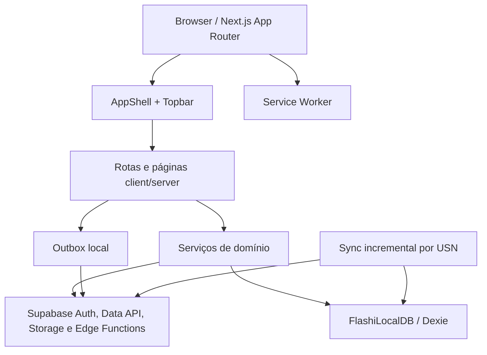

# Flashi — documentação técnica

## 1. Estado e escopo

O Flashi é uma aplicação web de flashcards construída com **Next.js App Router**, **React**, **Supabase** e **Dexie**. O frontend fornece autenticação, gestão de decks e cartões, estudo com repetição espaçada, importações, pesquisa, mídia, oclusão de imagem, exames, gamificação, otimização FSRS, persistência local e um adaptador MCP.

Este documento descreve o que existe no código desta branch. Não é uma especificação futura nem uma promessa de funcionalidades. Quando uma área depende de uma flag, de sessão autenticada, de Storage, de uma Edge Function ou de um worker backend, isso é indicado explicitamente.

### Fonte de verdade usada nesta documentação

- código versionado em `app/`, `components/`, `lib/`, `src/`, `scripts/` e `tests/`;
- configuração em `package.json`, `tsconfig.json`, `playwright.config.ts`, `proxy.ts`, `.env.example` e `public/sw.js`;
- tipos Supabase em `src/types/database.ts`;
- backend de referência `barrosrafa/Flashi`, branch `v2`, incluindo `supabase/functions/`, `supabase/migrations/` e `supabase/functions/README.md`;
- testes e validadores executados nesta revisão.

Documentos em `docs/` preservam auditorias e checkpoints históricos. Eles são evidência de trabalhos anteriores, mas não substituem o código atual quando houver divergência.

### Estado verificado da branch

- Branch: `main`.
- Implementação SDD v5 e correção abrangente de i18n publicadas no repositório frontend.
- Backend de referência: `barrosrafa/Flashi`, branch `v2`.
- O frontend não altera o repositório do backend.

---

## 2. Arquitetura efetivamente implementada



### Camadas

| Camada | Localização | Responsabilidade real |
|---|---|---|
| Apresentação | `app/`, `components/` | Rotas, formulários, estados de carregamento, erro, vazio e feedback. |
| Serviços | `lib/services/` | Validação de entradas, chamadas à Data API, Storage, RPCs e Edge Functions. |
| Cliente Edge comum | `lib/services/http/` | Auth check, timeout, retry, classificação de 401/403/429/503 e evento global. |
| Persistência local | `lib/db/` | Dexie, cursor USN, tombstones, outbox e worker opcional. |
| Tipos | `src/types/database.ts` | Tipos gerados/espelhados das tabelas, enums e funções Supabase usadas pelo frontend. |
| PWA | `app/manifest.ts`, `public/sw.js` | Manifesto, cache do shell e fallback de navegação offline. |
| Backend | repositório `Flashi` | RLS, integridade, RPCs, filas, processamento assíncrono, Storage e Edge Functions. |

O browser usa somente a chave pública do Supabase. Não há `service_role` no frontend. O worker `fsrs-optimize-worker` e o `ai-ingest-worker` pertencem ao backend e não são invocados pelo browser.

---

## 3. Stack e execução local

### Dependências principais

- Node.js e pnpm;
- Next.js `16.1.0`;
- React `19.2.0` e `react-dom` `19.2.0`;
- TypeScript `5.9.3` em modo estrito;
- `@supabase/ssr` e `@supabase/supabase-js`;
- Dexie para IndexedDB;
- Vitest para testes unitários;
- Playwright para E2E;
- `zod` e `clsx` estão instalados, mas cada uso deve ser confirmado no código antes de ser assumido como parte de um fluxo.

### Scripts disponíveis

| Comando | Comportamento |
|---|---|
| `pnpm dev` | Inicia `next dev`. |
| `pnpm build` | Gera o build de produção com `next build`. |
| `pnpm start` | Inicia o servidor de produção após build. |
| `pnpm lint` | Está declarado como `next lint`; a disponibilidade depende da versão/configuração do Next instalada. |
| `pnpm typecheck` | Executa `tsc --noEmit`. |
| `pnpm test` | Executa `vitest run tests --exclude tests/e2e/**`. |
| `pnpm test:e2e` | Executa Playwright e pode iniciar `pnpm dev` automaticamente. |
| `pnpm smoke:ui` | Percorre rotas e viewports, sem acionar operações remotas. |
| `pnpm screenshots` | Atualiza a documentação visual desktop/mobile e o manifesto de capturas. |

### Variáveis mínimas

Crie `.env.local` com os valores do seu projeto Supabase e a origem pública que será usada no build. `NEXT_PUBLIC_SITE_URL` é a origem exata, sem caminho de página. Em produção, substitua o default local pela URL HTTPS estável antes de publicar.

```dotenv
NEXT_PUBLIC_SUPABASE_URL=https://<projeto>.supabase.co
NEXT_PUBLIC_SUPABASE_PUBLISHABLE_KEY=sb_publishable_...
NEXT_PUBLIC_SITE_URL=http://localhost:3000
```

O `.env.example` contém uma URL pública de projeto e uma chave de exemplo substituível. Os ficheiros `.env*` são ignorados pelo Git, exceto `.env.example`.

### URL canônica e Auth Redirect URLs

- `NEXT_PUBLIC_SITE_URL` alimenta canonical, Open Graph, `robots.txt` e `sitemap.xml`; configure-a no ambiente **antes do build**.
- Em Supabase Dashboard → Authentication → URL Configuration, mantenha o Site URL de produção e acrescente a URL exata de callback de cada origem usada para testes, terminando em `/reset-password`.
- Não use wildcard de domínio. O preview temporário de sandbox é efêmero; substitua pela origem final da aplicação antes do deploy de produção.
- Os arquivos `.env.local` e segredos nunca devem ser versionados. A chave `sb_publishable_*` é a chave pública apropriada para o browser; nunca use `service_role` no frontend.

### Configuração de autenticação server-side

`proxy.ts` cria um `createServerClient` com `@supabase/ssr`, lê cookies do request, atualiza cookies quando necessário e chama `supabase.auth.getUser()`. O matcher cobre rotas não estáticas e exclui assets estáticos comuns. O proxy não implementa uma política de autorização de rota: a autorização de dados continua a ser feita por Auth, RLS, serviços e RPCs.

---

## 4. Rotas do frontend

Todas as rotas abaixo existem no App Router. A expressão **flag** significa que a página mostra o estado “funcionalidade desativada” quando a variável correspondente não está ativa; páginas com dado/identificador real também podem exigir uma sessão autenticada.

| Rota | Implementação | Dependências e comportamento |
|---|---|---|
| `/` | `app/page.tsx` | Landing pública SSR com conteúdo, CTAs, canonical/Open Graph condicionais ao domínio e zero dependência de sessão. |
| `/dashboard` | `app/dashboard/page.tsx` + `DashboardClient` | Painel autenticado com próxima revisão priorizada; sem sessão, orienta login e não deixa a fila parecer em carregamento infinito. |
| `/login` | `app/(auth)/login/page.tsx` | `signInWithPassword`; redireciona para `/dashboard`; oferece mostrar senha e recuperação. |
| `/forgot-password` | `app/(auth)/forgot-password/page.tsx` | Solicita e-mail de recuperação e retorna mensagem sem enumerar contas. |
| `/reset-password` | `app/(auth)/reset-password/page.tsx` | Valida confirmação e chama `auth.updateUser`; requer redirect autorizado no Supabase. |
| `/register` | `app/(auth)/register/page.tsx` | `signUp`; recolhe nome, email e senha; informa confirmação/erro do Auth. |
| `/decks` | `app/decks/page.tsx` + `DeckLibrary` | Lista decks autenticados; sem sessão, pede login sem exibir uma contagem falsa ou estado vazio. |
| `/decks/new` | `app/decks/new/page.tsx` | Cria deck autenticado e redireciona para o gestor de cards. |
| `/decks/[deckId]` | `app/decks/[deckId]/page.tsx` + `DeckDetailClient` | Carrega detalhe do deck; integra cards, notes, mídia e colaboração quando os contratos/flags estão disponíveis. |
| `/decks/[deckId]/cards` | `app/decks/[deckId]/cards/page.tsx` + `CardBrowser` | Cria, pesquisa e arquiva cards; criação usa `mcp_create_note`. |
| `/decks/[deckId]/notes` | `app/decks/[deckId]/notes/page.tsx` + `NoteWorkspace` | CRUD de notes, seleção de template, definições de campo, cloze e referências. |
| `/decks/[deckId]/occlusion/new` | `app/decks/[deckId]/occlusion/new/page.tsx` | **Flag `occlusion`**; upload de imagem, editor de caixas percentuais e RPC de oclusão. |
| `/study` | `app/study/page.tsx` | Lista decks para iniciar; diferencia fila vazia de falta de sessão. |
| `/study/[deckId]` | `app/study/[deckId]/page.tsx` | Fila real, frente/verso, ratings, review FSRS e fallback local. Também carrega template do card quando disponível. |
| `/study/demo` | mesma página com `deckId=demo` | Fixture local para demonstrar o fluxo sem tocar no backend. |
| `/study/search` | `app/study/search/page.tsx` | Página de busca relacionada ao estudo. |
| `/search` | `app/search/page.tsx` | **Flag `semantic_search`**; debounce de 350 ms, busca semântica com fallback lexical para indisponibilidade 503. |
| `/analytics` | `app/analytics/page.tsx` | Lê estatísticas e reviews; apresenta períodos de 7/30/90 dias, tabela acessível e comparações semanais quando há histórico. |
| `/exams` | `app/exams/page.tsx` | **Flag `exams`**; cria/lista exames e usa RPC de fila com prioridade. |
| `/profile` | `app/profile/page.tsx` | Lê/atualiza `profiles` e `study_settings` com sessão; não expõe formulário de valores padrão sem login. Aparência local continua acessível. |
| `/profile/badges` | `app/profile/badges/page.tsx` | **Flag `gamification`**; lê perfil XP, badges do usuário e catálogo. |
| `/tools` | `app/tools/page.tsx` | **Várias flags**; pesquisa, ingestão IA, FSRS, import/export Anki. |
| `/tools/mcp` | `app/tools/mcp/page.tsx` | **Flag `mcp`**; lista e executa as duas ferramentas do adaptador MCP. |
| `/settings/fsrs-optimize` | `app/settings/fsrs-optimize/page.tsx` | **Flag `fsrs_opt`**; solicita job de otimização. |
| `/import/ai-ingest` | `app/import/ai-ingest/page.tsx` | **Flag `ai_ingest`**; submete texto a um job e não materializa notas diretamente. |
| `/import/anki` | `app/import/anki/page.tsx` | **Flag `anki_io`**; usa `useAnkiImport` para upload `.apkg`. |
| `/export/anki` | `app/export/anki/page.tsx` | Exportação de deck através de `anki-transfer`. |
| `/import/url` | `app/import/url/page.tsx` | **Flag `import_url`**; browser faz `fetch` da URL, envia o arquivo ao bucket e chama `import-deck`. CORS é obrigatório. |
| `/media/[id]` | `app/media/[id]/page.tsx` | Exibe mídia através de URL assinada; estados sem recurso/sem registro não fabricam conteúdo. |
| `/occlusion` | `app/occlusion/page.tsx` | **Flag `occlusion`**; formulário simples de nota e regiões percentuais. |
| `/manifest.webmanifest` | `app/manifest.ts` | Resposta JSON gerada pelo Next; não é uma tela de UI. |

---

## 5. Shell, componentes e acessibilidade

### Shell

`components/AppShell.tsx` fornece:

- skip link para `#main-content`;
- marca e link para `/dashboard`;
- navegação com `aria-label` e `aria-current`;
- ícones SVG decorativos;
- avatar/link para `/profile`;
- `Topbar` com título e subtítulo;
- `SyncStatusPanel`, que informa offline, alterações pendentes, falhas e ações de sincronização local.

`app/layout.tsx` registra `ServiceWorkerRegister`, `SyncWorkerRegister` e `EdgeErrorNotice`. `NEXT_PUBLIC_SITE_URL` configura a origem canônica da landing; o `manifest`, ícones e metadata pública estão no App Router.

### Componentes de domínio

| Componente | Função |
|---|---|
| `DeckLibrary` | Busca e apresenta decks, progresso, estados de erro e vazio. |
| `CardBrowser` | Lista cards de um deck, busca local, formulário de criação e arquivamento. |
| `NoteWorkspace` | Lista, pesquisa, cria, edita e exclui notes; carrega definições de template, cria campos, clozes e referências. |
| `ReferenceEditor` | Adiciona e remove referências direcionadas entre notes com validação de auto-referência. |
| `MediaManager` | Faz upload, associa, lista, edita metadados, visualiza e remove mídia do escopo do deck/card. |
| `MediaViewer` | Renderiza áudio, vídeo ou imagem conforme MIME. |
| `CollaboratorManager` | Lista colaboradores e oferece operações de administração previstas pelo contrato de colaboração. |
| `WorkerJobMonitor` | Lista jobs AI/FSRS, atualiza status e expõe retry somente para estados suportados pelo serviço. |
| `OcclusionEditor` | Converte pointer coordinates em percentuais e desenha caixas. |
| `OcclusionCard` | Mostra imagem com regiões clicáveis para revelar/ocultar. |
| `SemanticHitRow` | Apresenta score, tipo, campos e ID de uma nota encontrada. |
| `RateLimitBanner` | Faz countdown client-side para erro 429. |
| `EdgeErrorNotice` | Observa o event bus global e exibe Auth, rate limit ou erro genérico. |
| `ServiceWorkerRegister` | Registra `/sw.js` no browser. |
| `SyncWorkerRegister` | Inicia o worker local, sujeito a `NEXT_PUBLIC_FF_SYNC_WORKER`. |

### CSS e acessibilidade

`app/globals.css` contém o design system Aurora, superfícies, cards, formulários, tabela, estados, responsividade, `:focus-visible` e `prefers-reduced-motion`. A sessão de estudo usa região viva, labels de estado, barra de progresso, botão de revelar e ratings com atalhos `1`–`4`.

O teste e2e não substitui auditoria de acessibilidade. Os checks existentes cobrem principalmente headings, labels, erros de runtime, overflow e tamanho mínimo de botões no smoke test.

---

## 6. Serviços de domínio

### Dashboard, decks e cards

- `dashboard-service.ts`: exige usuário; combina `get_due_cards`, `get_current_streak`, `daily_statistics`, `user_gamification_profiles` e `listDecks`.
- `deck-service.ts`: lista decks e conta cards/estado de aprendizagem; usa Dexie como fallback de leitura em pontos definidos no código; `createDeck` exige sessão e insere `user_id`.
- `card-service.ts`: lista cards; `createCard` valida frente/verso, chama `mcp_create_note`, lê o card criado e dispara atualização de embedding; `updateCard` atualiza note/card; `archiveCard` faz soft delete do card.
- `study-service.ts`: chama `fsrs-review` para review; se a operação remota falhar, enfileira a mutação; busca fila por `get_due_cards` e possui fallback de leitura de cards quando a RPC não retorna itens.

### Perfil, analytics e exames

- `profile-service.ts`: lê `profiles` e `study_settings`; atualiza ambos com `upsert`.
- `analytics-service.ts`: consulta `daily_statistics` e `review_logs`, normaliza os últimos sete dias e calcula volume/tempo/precisão.
- `exam-service.ts`: CRUD de `deck_exams`, marca remoção como `status='done'` e consulta `get_due_cards_with_exam_schedule`.

### Busca

- `search-service.ts`: aceita `semantic` ou `lexical`, limita a consulta a 8.000 caracteres e repete em lexical quando a Edge Function reporta indisponibilidade.
- `semantic-search-service.ts`: exige pelo menos três caracteres, limita `limit` entre 1 e 100 e usa `noRetryOnUnavailable` para controlar o fallback.

### FSRS

- `optimizer-service.ts`: solicita `fsrs-optimize` com `mode='request'`, consulta `fsrs_optimization_runs`, executa manualmente `mode='run'` e consulta status por RPC.
- `fsrs-optimize-service.ts`: fachada usada pela página de configurações.
- O cálculo dos pesos e o processamento de reviews pertencem às Edge Functions/backend; o browser não implementa o algoritmo FSRS.

### IA e importação por URL

- `ingestion-service.ts`: aceita `pdf_document`, `youtube_url`, `raw_text_block` e `web_page`; texto enviado pelo cliente é limitado a 2.000 caracteres; PDF é enviado para `import-media`; jobs são consultáveis por `ai_ingestion_jobs`.
- `import-deck-service.ts`: aceita `csv`, `markdown`, `quizlet` e `remnote`; limita arquivos a 15 MiB; URL é baixada pelo browser e depende de CORS; o arquivo é enviado ao bucket `import-media` antes de `import-deck`.
- `ai-ingest-worker` e materialização das sugestões são backend. A UI informa que o conteúdo não é salvo sem revisão, mas a geração e materialização não ocorrem no componente React.

### Anki

- `anki-service.ts`: exige extensão `.apkg`, limita a 50 MiB, envia para `anki-transfers/<user_id>/imports/`, chama `anki-transfer` e mostra progresso em dois marcos (`0.5` e `1`).
- Exportação chama `anki-transfer`, cria URL assinada por 300 segundos e devolve metadados do arquivo.
- `useAnkiImport.ts` centraliza busy, progresso, resultado, erro e limpeza do input.

### Mídia e oclusão

- `media-service.ts`: lista mídia por card/deck, envia bytes para `card-media/<owner>/<cardId ou unattached>/<uuid>.<ext>`, cria URLs assinadas, atualiza metadados, remove o registro e tenta limpar o objeto de Storage; também consulta mídia órfã conforme o RPC disponível.
- `MediaManager` é a interface de upload/associação/preview/edição/exclusão. Upload sem card usa o segmento `unattached` para que o fluxo de oclusão possa associar o arquivo depois.
- `occlusion-service.ts`: transforma máscaras em `x_pos`, `y_pos`, `width_pct`, `height_pct`, exige valores dentro de 0–100 e chama `create_image_occlusion_note(p_note_id, p_boxes)`.
- O serviço não cria uma nota nova: recebe uma `noteId` existente.

### Notes, cloze e referências

- `note-service.ts`: CRUD de notes e operações de `note_card_definitions`, `note_cloze_deletions` e `note_references`, mantendo os campos estruturados como JSON compatível com os tipos gerados.
- `NoteWorkspace` usa templates existentes quando selecionados; sem template, mantém os campos `Front` e `Back`, permite adicionar campos e salva a note antes de permitir clozes/referências dependentes.
- `reference-service.ts`: cria e remove referências direcionadas e rejeita auto-referência no cliente antes da validação final por RLS/RPC.

### Colaboração e jobs

- `collaborator-service.ts`: lista colaboradores, cria/atualiza/remove relações conforme o papel do usuário e usa o backend como autoridade de autorização; não concede acesso alterando apenas estado local.
- `ingestion-service.ts` e `fsrs-optimize-service.ts`: expõem listagem de histórico, atualização e retry apenas para jobs e estados que o backend aceita.
- `WorkerJobMonitor` é usado nas telas de ingestão AI e otimização FSRS para mostrar histórico, status, erro e retry. Cancelamento não é inventado quando não existe RPC correspondente.
- `mcp-audit-service.ts`: consulta `mcp_tool_audit` para exibir ferramenta, status, latência, request ID e data no painel MCP; não exibe secrets.

### Gamificação e MCP

- `gamification-service.ts`: lê perfil, definições, badges do usuário e chama `add_user_xp`.
- `template-renderer.ts`: valida e interpola `{{FieldName}}`, suporta múltiplas gerações e fallback `Front`/`Back`; é usado na sessão quando o card tem `template_id`.
- `mcp-client.ts`: expõe `search_notes` e `create_note`, suporta `tools/list` e `tools/call`, e traduz `create_note` para a RPC `mcp_create_note`.

---

## 7. Persistência local, sincronização e outbox

### Banco Dexie

`lib/db/schema.ts` cria o banco `FlashiLocalDB` e versões 1, 2 e 3. As tabelas/indexes declarados incluem:

```text
decks, notes, note_card_definitions, note_cloze_deletions,
note_references, note_image_occlusion_boxes, cards, card_tags,
card_media, card_learning_state, card_templates, field_definitions,
tags, review_logs, study_settings, user_deck_settings,
daily_statistics, fsrs_optimization_runs, deck_collaborators,
deck_exams, user_gamification_profiles, user_badges,
badges_definition, socratic_remediation_sessions, ai_ingestion_jobs,
anki_transfer_jobs, profiles, mcp_tool_audit,
learning, reviews, exams, outbox, sync_meta.
```

`learning`, `reviews` e `exams` são nomes locais usados pelo schema/repositórios; as tabelas remotas principais correspondentes são `card_learning_state`, `review_logs` e `deck_exams`. O schema declara tipos locais para deck, card, learning, review, exam, template, profile, auditoria MCP, mutação offline e metadata do cursor.

### Sync incremental

`executeIncrementalSync()`:

1. lê `last_usn` em `sync_meta`;
2. chama a Edge Function `sync` com `last_usn` e `limit=500`;
3. separa registros ativos e tombstones;
4. mapeia `entity_type` para tabela local;
5. grava tombstones antes dos registros ativos;
6. grava `_dirty=0` e `_synced_at` nos registros recebidos;
7. avança o cursor na mesma transação Dexie;
8. registra telemetria local de sucesso/falha.

O mapa inclui aliases como `deck`, `note`, `card`, `card_learning_state`, `review_log`, `card_template`, `profile`, `mcp_tool_audit`, `ai_ingestion_job`, `deck_exam`, `user_badge` e `socratic_remediation_session`. Tipos desconhecidos são ignorados.

### Worker

`startSyncWorker(intervalMs=60000)` só inicia no browser, com `NEXT_PUBLIC_FF_SYNC_WORKER` ativo e uma única instância. Executa ao iniciar, a cada intervalo, no evento `online` e no evento `focus`. Não executa em paralelo e não executa quando `navigator.onLine` é falso.

Importante: o worker está desativado por padrão no `.env.example`. A sincronização local só é automática quando a flag está ativa e o componente está montado no layout.

### Outbox

`enqueueMutation()` gera `client_mutation_id`, grava a mutação no IndexedDB, registra telemetria e dispara flush se o browser estiver online.

A implementação de flush suporta explicitamente estas tabelas remotas:

```text
decks, notes, cards, card_media, deck_exams, review_logs
```

- ação `rpc` usa RPC direta quando `transport='rpc'`;
- ação `rpc` usa Edge Function quando `transport='edge'`;
- insert/update usa `upsert` após remover `client_mutation_id` do row payload;
- delete exige `payload.id` e remove por ID;
- erro incrementa retries e interrompe a fila no primeiro item que falhar;
- após o flush, tenta sync incremental.

A tabela local de outbox aceita mais nomes, mas isso não significa que todas as tabelas sejam flusháveis: nomes fora do union suportado retornam `OUTBOX_TABLE_NOT_SUPPORTED`.

### Telemetria local

`lib/db/telemetry.ts` grava no `localStorage` até os últimos 100 eventos em `flashi.telemetry`. Os eventos são `sync.success`, `sync.failure`, `outbox.enqueued`, `outbox.failure` e `outbox.flushed`. A telemetria não é enviada automaticamente para um serviço remoto neste código.

### Repositórios

`BaseRepository` e `lib/db/repositories/index.ts` expõem instâncias para decks, notes, cards, templates, tags, reviews, schedule, FSRS runs, mídia, IA, embeddings, gamificação, badges, exames, sessões socráticas, perfil e auditoria MCP. `sync-registry.ts` registra apenas o conjunto de handlers definido no próprio arquivo; registrar um repositório não cria automaticamente sincronização remota.

---

## 8. Contratos backend usados pelo frontend

O backend `Flashi@v2` contém migrations PostgreSQL/Supabase, RLS, RPCs e Edge Functions. O frontend usa o cliente Supabase com JWT do usuário.

### Edge Functions chamadas pelo frontend

| Função | Chamador | Uso |
|---|---|---|
| `sync` | `sync-engine.ts` | Busca alterações por USN. |
| `fsrs-review` | `study-service.ts` | Registra review e atualiza estado FSRS. |
| `embeddings` | `embedding-service.ts`, `card-service.ts` | Indexa nota/deck. |
| `semantic-search` | `search-service.ts`, `semantic-search-service.ts` | Busca semântica ou lexical. |
| `fsrs-optimize` | `optimizer-service.ts` | Solicita/executa otimização do usuário. |
| `anki-transfer` | `anki-service.ts` | Importa/exporta `.apkg`. |
| `ai-ingest` | `ingestion-service.ts` | Enfileira conteúdo para IA. |
| `import-deck` | `import-deck-service.ts` | Processa arquivo importado. |

O backend também contém `fsrs-optimize-worker` e `ai-ingest-worker`; estes são workers protegidos e não fazem parte das chamadas browser.

### RPCs/Data API usadas

| Contrato | Uso no frontend |
|---|---|
| `get_due_cards` | Fila básica de estudo/dashboard. |
| `get_due_cards_with_exam_schedule` | Fila priorizada por exame. |
| `get_incremental_sync` | Indiretamente pela Edge Function `sync`. |
| `get_current_streak` | Dashboard. |
| `get_fsrs_optimization_status` | Status FSRS. |
| `mcp_create_note` | Criação transacional de note/cards e criação de card pelo `CardBrowser`. |
| `create_image_occlusion_note` | Criação de cards Cloze a partir de caixas. |
| `add_user_xp` | Gamificação. |
| `mcp_search_notes` | Indiretamente pela Edge Function `semantic-search`. |
| `enqueue_fsrs_optimization` | Indiretamente por `fsrs-optimize`. |
| `create_anki_transfer_job` | Indiretamente por `anki-transfer`. |

Além das RPCs, os serviços fazem operações Data API em `profiles`, `study_settings`, `decks`, `notes`, `cards`, `card_learning_state`, `review_logs`, `daily_statistics`, `deck_exams`, `fsrs_optimization_runs`, `ai_ingestion_jobs`, `user_gamification_profiles`, `user_badges`, `badges_definition` e `card_media`, conforme o fluxo.

### Storage

Buckets usados pelo código:

| Bucket | Uso |
|---|---|
| `card-media` | Mídia associada a cards e oclusão. |
| `anki-transfers` | Upload/download temporário de `.apkg`. |
| `import-media` | Arquivos de importação de deck e PDF de ingestão. |

O frontend gera paths começando pelo UUID do usuário quando o serviço conhece a sessão. URLs de mídia e exportação são assinadas; não são tratadas como URLs públicas permanentes.

---

## 9. Cliente Edge, erros e segurança

### `invokeEdge`

`lib/services/http/edge-client.ts`:

- verifica sessão via `auth.getSession()` antes da chamada;
- timeout padrão de 30 segundos;
- retries padrão de 2;
- usa `AbortController` e `Promise.race`;
- não repete 429;
- classifica 401/403 como `AuthRequiredError`;
- pode classificar 503 como `UnavailableError` quando `noRetryOnUnavailable` está ativo;
- repete falhas transitórias até o limite;
- publica erros no `edgeErrorBus`.

Os tipos são `EdgeError`, `RateLimitError`, `AuthRequiredError`, `UnavailableError` e `EdgeTimeoutError`. `RateLimitBanner` apresenta o countdown quando a página trata `retryAfterSec`.

### Regras de segurança implementadas/esperadas

- chave privada/service role não está no frontend;
- o user ID é obtido do Supabase Auth em serviços que precisam construir paths ou payloads;
- RLS do backend é a autoridade final de ownership;
- o frontend não executa ZIP, SQLite ou conteúdo Anki como código;
- upload Anki e mídia usa buckets privados e URLs assinadas;
- workers backend com service role não são chamados do browser;
- payloads são limitados em tamanho nos serviços e no backend;
- não existe mecanismo no frontend para contornar RLS.

A autenticação de uma rota não equivale à autorização de cada operação: as RPCs e policies precisam continuar ativas no backend.

---

## 10. Feature flags

Existem duas camadas de leitura de flags: `lib/feature-flags.ts` e `lib/config/feature-flags.ts`. A primeira aceita `1` ou `true`; a segunda compara diretamente com `1` para as flags v2/v3/v4 e usa fallback para a primeira camada em `isEnabled`.

| Variável | Flag | Uso observado |
|---|---|---|
| `NEXT_PUBLIC_FF_SYNC_WORKER` | `sync_worker` | Worker de sincronização. |
| `NEXT_PUBLIC_FF_MEDIA` | `media` | Flag declarada; uso de mídia também aparece diretamente em rotas/serviços. |
| `NEXT_PUBLIC_FF_SEMANTIC` | `semantic` | Flag legada. |
| `NEXT_PUBLIC_FF_ANKI` | `anki` | Flag legada. |
| `NEXT_PUBLIC_FF_ANKI_IO` | `anki_io` | Importação Anki. |
| `NEXT_PUBLIC_FF_AI_INGEST` | `ai_ingest` | Ingestão IA. |
| `NEXT_PUBLIC_FF_GAMIFICATION` | `gamification` | Badges e perfil XP. |
| `NEXT_PUBLIC_FF_COLLAB` | `collab` | Flag declarada para colaboração. |
| `NEXT_PUBLIC_FF_FSRS_OPT` | `fsrs_opt` | Otimização FSRS. |
| `NEXT_PUBLIC_FF_EXAMS` | `exams` | Exames. |
| `NEXT_PUBLIC_FF_OCCLUSION` | `occlusion` | Oclusão. |
| `NEXT_PUBLIC_FF_SYNC_V2` | `sync_v2` | Flag de configuração v2. |
| `NEXT_PUBLIC_FF_SEMANTIC_SEARCH` | `semantic_search` | Rota `/search`. |
| `NEXT_PUBLIC_FF_IMPORT_URL` | `import_url` | Importação por URL. |
| `NEXT_PUBLIC_FF_MCP` | `mcp` | Rota `/tools/mcp`. |
| `NEXT_PUBLIC_FF_TEMPLATE_RENDERER` | `template_renderer` | A flag existe e vem ativada por defeito na camada v4; a sessão também mantém fallback de template. |
| `NEXT_PUBLIC_FF_TAGS` | `tags` | Edição e persistência de tags em cards. |
| `NEXT_PUBLIC_FF_SOCRATIC` | `socratic` | Lista e detalhe de sessões socráticas. |
| `NEXT_PUBLIC_FF_TEMPLATES` | `templates` | Lista e detalhe de templates. |
| `NEXT_PUBLIC_FF_REFERENCES` | `references` | Editor de referências entre notes. |

O `.env.example` habilita as flags listadas para ambiente de desenvolvimento. Defina cada `NEXT_PUBLIC_FF_*` para `0` quando quiser simular uma funcionalidade desligada; altere `.env.local` e reinicie o Next.js.

---

## 11. PWA e offline de navegação

`app/manifest.ts` declara:

- nome e nome curto `Flashi`;
- idioma `pt-BR`;
- display `standalone`;
- cores de fundo/tema;
- categorias `education` e `productivity`;
- início em `/dashboard` e atalhos para `/study/demo` e `/decks`;
- ícones SVG, PNG 192×192, PNG 512×512 maskable e Apple Touch Icon.

`public/sw.js` usa cache `flashi-shell-v2`, pré-cacheia um conjunto de rotas públicas e aplica network-first para navegação. Quando a navegação falha, tenta o request em cache e depois `/dashboard`. Assets GET também usam cache-first com preenchimento posterior.

Isso torna a **navegação do shell** resiliente depois de aquecida. Não significa que a Data API, Storage, Edge Functions ou todas as páginas dinâmicas funcionem sem rede. Dados locais e reviews dependem adicionalmente de Dexie, outbox e flags descritas na secção de sincronização.

---

## 12. Implementação v5 de paridade de funcionalidades

Esta branch fechou as lacunas de interface que existiam apesar de os contratos já estarem no backend. O escopo implementado é:

1. **Notes:** rota própria e workspace para CRUD, campos definidos pelo template, cloze e referências; a note é salva antes das operações dependentes do seu ID.
2. **Mídia:** serviço e `MediaManager` para upload em bucket privado, associação a card, preview por URL assinada, atualização de metadados, exclusão e tratamento de mídia não associada.
3. **Colaboração:** `CollaboratorManager` integrado ao detalhe do deck, com operações de relação delegadas ao serviço autenticado, sem simular permissões no cliente.
4. **Workers:** histórico, status, erro, atualização e retry controlado de jobs de ingestão AI e FSRS nas páginas respectivas; workers protegidos continuam sendo backend-only.
5. **Auditoria MCP:** histórico de chamadas `mcp_tool_audit` visível no painel MCP, sem persistir ou renderizar tokens.
6. **Sincronização:** flags centralizadas em `lib/config/feature-flags.ts`; o sync local é isolado por usuário, preserva cursores bigint como string e reseta estado local ao trocar de conta.
7. **Cards e templates:** tags normalizadas são persistidas pelo contrato de tags; o detalhe do deck deixou de ser somente uma tela estática e carrega dados reais.

Essas telas não alteram o schema nem substituem RLS. Quando uma flag está desligada, a rota mostra o estado de recurso desativado; quando um contrato depende de usuário, deck, note ou job existente, o estado vazio é mostrado em vez de dados de demonstração.

O manual visual e operacional, com capturas atualizadas em desktop e mobile, está em [`docs/manual_usuario.md`](docs/manual_usuario.md). As imagens desktop são `docs/*.webp`; a variação mobile está em `docs/screenshots/mobile/` e o manifesto das capturas está em `docs/screenshots/capture-manifest.json`.

## 13. Testes e validação

### Testes unitários atuais

`pnpm test` executa os testes unitários presentes em `tests/`. Nesta revisão, 27 testes em 8 arquivos passaram; a cobertura inclui:

- `tests/auth-messages.test.ts`: mensagens de autenticação e recuperação de senha;
- `tests/edge-client.test.ts`: autenticação, retorno normal, 429, retry 503, indisponibilidade sem retry e timeout;
- `tests/feature-services.test.ts`: validação de oclusão e coordenadas percentuais;
- `tests/i18n.test.ts`: integridade dos recursos de tradução;
- `tests/mcp-client.test.ts`: listagem de tools, `tools/list` e erro de tool desconhecida;
- `tests/sync-engine.test.ts`: aliases de entidades, tipos desconhecidos, mutation ID e ratings;
- `tests/template-renderer.test.ts`: interpolação, múltiplas gerações e template inválido;
- `tests/v5-features.test.ts`: contratos de serviços introduzidos na paridade v5.

### E2E Playwright

`tests/e2e/routes.spec.ts` cobre rotas principais e secundárias do App Router, ausência de erros JavaScript, formulários/labels, SEO/PWA, exibição de resposta e avaliação na prévia, navegação offline, menus móveis, validação da confirmação de senha, divulgação de campos opcionais e overflow em 320–1280px. Operações remotas (cadastro, envio de recuperação, upload e gravação de conteúdo) não são submetidas pela suíte pública. O fluxo autenticado opcional de login, criação de deck e card só roda com credenciais de homologação.

O fluxo autenticado só roda quando `E2E_EMAIL` e `E2E_PASSWORD` estão definidos. Sem essas variáveis, é intencionalmente skipped; não há credenciais no repositório.

### Scripts auxiliares

| Script | Uso |
|---|---|
| `scripts/ui-smoke.mjs` | Visita 36 rotas em desktop/tablet/mobile, verifica erros, overflow e nomes/tamanho dos controles; clica somente em controles locais reversíveis, nunca em envios ou ações destrutivas. Rode com `pnpm smoke:ui`. |
| `scripts/capture-screens.mjs` | Captura 36 estados/telas em desktop e mobile e grava imagens WebP em `docs/*.webp` e `docs/screenshots/mobile/`, com manifesto em `docs/screenshots/capture-manifest.json`. Rode com `pnpm screenshots` com o app em `localhost:3000`. |
| `scripts/make-contact-sheet.py` | Agrupa capturas em folhas de contacto; requer Pillow no ambiente. |
| `scripts/supabase-smoke.mjs` | Faz checks REST/Edge com URL e publishable key fornecidas no ambiente; não autentica um usuário. |

### Validação desta revisão

Verificação executada nesta revisão (03/10/2026):

- `pnpm typecheck`: passou.
- `pnpm test`: 27 testes em 8 arquivos, todos passaram.
- `pnpm build`: passou; Next.js gerou 33 páginas estáticas e as rotas dinâmicas esperadas.
- `pnpm test:e2e`: 46 passaram; 1 teste autenticado ficou intencionalmente ignorado por não haver credenciais de homologação.
- `pnpm smoke:ui`: 36 rotas em desktop/tablet/mobile; 1.654 controles visíveis verificados sem erros, overflow ou alvos pequenos.
- `pnpm screenshots`: 71 imagens WebP atualizadas (35 desktop + 36 mobile), sem falhas de rota; manifesto em `docs/screenshots/capture-manifest.json`.
- `git diff --check`: passou.

As suítes não submetem cadastro, recuperação de senha, upload ou gravação remota. O teste autenticado de persistência requer `E2E_EMAIL` e `E2E_PASSWORD` de homologação.

---

## 14. Limitações e pontos que não devem ser inferidos

1. O README não afirma que todas as entidades de `SYNC_TABLES` são escritas/flushadas pelo frontend: a outbox implementa apenas seis tabelas de upsert/delete.
2. A existência de um repositório Dexie não prova que uma página use esse repositório em vez da Data API.
3. `SyncWorkerRegister` está sempre montado, mas o worker não inicia com a flag padrão desligada.
4. A UI de ingestão cria jobs; o worker do backend materializa notas e cards diretamente no deck, e precisa estar agendado para retirar jobs da fila.
5. A importação por URL é baixada no backend para evitar CORS; são aceitos destinos HTTPS públicos com limite de 15 MiB.
6. A oclusão recebe uma nota existente e cria cartões Cloze; não cria automaticamente um deck ou uma nota a partir do ID do deck.
7. O template renderer interpola texto; não é um motor de HTML seguro, não executa código e não implementa editor de templates.
8. O adaptador MCP é um cliente local da aplicação; esta branch não expõe um servidor MCP HTTP público.
9. `fsrs-optimize-worker` e `ai-ingest-worker` são componentes backend protegidos e não devem receber chamadas do browser.
10. O service worker cobre shell/cache de navegação, não sincronização de dados remotos.
11. O manifest declara ícones SVG/PNG locais e Apple Touch Icon; verifique as dimensões/assets com `pnpm test:e2e` antes de publicar.
12. Os documentos de auditoria em `docs/` podem descrever checkpoints anteriores, fixtures e números antigos; não devem ser interpretados como estado atual sem confirmação no código.
13. `NEXT_PUBLIC_FF_MEDIA`, `NEXT_PUBLIC_FF_SEMANTIC`, `NEXT_PUBLIC_FF_ANKI` e `NEXT_PUBLIC_FF_COLLAB` existem na configuração, mas a ativação efetiva de uma tela deve ser confirmada na rota correspondente.
14. Não há teste E2E autenticado executado sem credenciais de homologação; testes públicos não comprovam persistência real para um usuário específico.

---

## 15. Inventário técnico do código

### Rotas e shell

```text
app/(auth)/login/page.tsx
app/(auth)/register/page.tsx
app/(auth)/forgot-password/page.tsx
app/(auth)/reset-password/page.tsx
app/analytics/page.tsx
app/decks/[deckId]/cards/page.tsx
app/decks/[deckId]/occlusion/new/page.tsx
app/decks/[deckId]/page.tsx
app/decks/new/page.tsx
app/decks/page.tsx
app/exams/page.tsx
app/export/anki/page.tsx
app/import/ai-ingest/page.tsx
app/import/anki/page.tsx
app/import/url/page.tsx
app/layout.tsx
app/manifest.ts
app/dashboard/page.tsx
app/media/[id]/page.tsx
app/occlusion/page.tsx
app/page.tsx
app/profile/badges/page.tsx
app/profile/page.tsx
app/search/page.tsx
app/settings/fsrs-optimize/page.tsx
app/study/[deckId]/page.tsx
app/study/search/page.tsx
app/tools/mcp/page.tsx
app/tools/page.tsx
```

### Componentes

```text
AppShell.tsx              CardBrowser.tsx       DeckLibrary.tsx
EdgeErrorNotice.tsx       MediaViewer.tsx       OcclusionCard.tsx
OcclusionEditor.tsx       RateLimitBanner.tsx   SemanticHitRow.tsx
ServiceWorkerRegister.tsx SyncWorkerRegister.tsx
```

### Serviços e hooks

```text
analytics-service.ts       anki-service.ts          card-service.ts
dashboard-service.ts       deck-service.ts          edge-service.ts
embedding-service.ts       exam-service.ts          fsrs-optimize-service.ts
gamification-service.ts    import-deck-service.ts  ingestion-service.ts
mcp-client.ts               media-service.ts        occlusion-service.ts
optimizer-service.ts       profile-service.ts      search-service.ts
semantic-search-service.ts  study-service.ts        template-renderer.ts
supabase-client-compat.ts   useAnkiImport.ts
```

### Banco local e infraestrutura

```text
lib/db/schema.ts
lib/db/outbox-queue.ts
lib/db/sync-engine.ts
lib/db/sync-registry.ts
lib/db/sync-worker.ts
lib/db/telemetry.ts
lib/db/repositories/*.ts
lib/config/feature-flags.ts
lib/feature-flags.ts
lib/services/http/edge-client.ts
lib/services/http/errors.ts
lib/services/http/event-bus.ts
lib/supabase/client.ts
src/types/database.ts
```

### Testes, scripts e documentação auxiliar

```text
tests/*.test.ts
tests/e2e/routes.spec.ts
scripts/capture-screens.mjs
scripts/make-contact-sheet.py
scripts/supabase-smoke.mjs
scripts/ui-smoke.mjs
docs/backend-contract-notes.md
docs/browser-verification.md
docs/flashcard-refactor-audit.md
docs/integration-verification.md
docs/redesign-report.md
docs/redesign-visual-notes.md
docs/reference-benchmark-notes.md
docs/ux-audit-notes.md
docs/ux-ui-audit.md
design-system/flashi-aurora/MASTER.md
FLASHI_SSD_CONSOLIDADO.md
```

Os repositórios individuais em `lib/db/repositories/` são, em grande parte, reexports de instâncias criadas em `index.ts`; isso é uma convenção de importação, não uma implementação independente por ficheiro.

---

## 16. Procedimento para alterações

1. Confirmar o contrato em `src/types/database.ts` e no backend `Flashi` antes de criar uma chamada.
2. Não adicionar nomes de RPC, tabelas, buckets ou Edge Functions sem verificar que existem no backend alvo.
3. Implementar validação no serviço, estado de loading/erro/vazio na página e feedback acessível.
4. Atualizar testes unitários do contrato alterado.
5. Executar `pnpm typecheck`, `pnpm test`, `pnpm build` e, quando aplicável, `pnpm test:e2e`.
6. Se o fluxo for offline, testar cursor, tombstone, outbox, retries e comportamento sem rede separadamente.
7. Executar `git diff --check` e rever o diff para evitar documentação ou código duplicado.
8. Descrever no commit/PR quais contratos backend foram consumidos e quais limitações permanecem.

### Referências técnicas

- [Next.js App Router](https://nextjs.org/docs/app)
- [Supabase JavaScript](https://supabase.com/docs/reference/javascript/introduction)
- [Supabase SSR](https://supabase.com/docs/guides/auth/server-side/creating-a-client)
- [Supabase Edge Functions](https://supabase.com/docs/guides/functions)
- [Dexie](https://dexie.org/docs/)
- [Playwright](https://playwright.dev/docs/intro)
- [Vitest](https://vitest.dev/guide/)
- [WCAG 2.2](https://www.w3.org/TR/WCAG22/)

**Última auditoria técnica:** 2026-10-02 — implementação SDD v5.


---

## 17. Implementação do SDD v5

A feature/v5 implementa as funcionalidades do SDD que tinham contrato disponível no backend `Flashi@v2`. A implementação foi feita sobre os serviços e componentes existentes; não foram criadas RPCs, tabelas, buckets ou Edge Functions novas.

### 16.1 Colaboração em decks

- Serviço: `lib/services/collaborator-service.ts`.
- Tipos: `lib/types/collaborator.ts`.
- Hook: `hooks/useDeckCollaborators.ts`.
- UI: `components/decks/CollaboratorManager.tsx`.
- Integração: detalhe do deck, condicionada a `NEXT_PUBLIC_FF_COLLAB`.
- Operações: listar, adicionar/atualizar/remover por Data API em `deck_collaborators`.
- Roles aceitos pelo backend: `viewer` e `editor`.

O backend não expõe uma RPC ou relação `profiles` para resolver email em `user_id`. Por isso a UI solicita o UUID do usuário Supabase. Não há resolução fictícia por email nem lookup administrativo no frontend.

### 16.2 Tags e relações card/tag

- Serviço: `lib/services/tag-service.ts`.
- Tipos: `lib/types/tag.ts`.
- Hook: `hooks/useTags.ts`.
- UI: `components/tags/TagSelector.tsx`, exibida no `CardBrowser`.
- Tabelas: `tags` e `card_tags`.
- Operações: listar, criar/upsert por nome, remover, listar tags do card, associar e desassociar.
- A criação obtém o `user_id` da sessão autenticada para respeitar a policy `tags_owner`.
- Flag: `NEXT_PUBLIC_FF_TAGS` está documentada e desligada por padrão; a tabela pode ser usada pela UI de cards quando a funcionalidade for ativada no produto.

O campo textual de tags que já existia no formulário de criação de card continua sendo preservado. A relação normalizada `card_tags` é gerida pelo seletor v5, não por uma interpretação inventada desse texto.

### 16.3 Configurações específicas por deck

- Serviço: `lib/services/deck-settings-service.ts`.
- Tipo: `lib/types/deck-settings.ts`.
- UI: `components/decks/DeckSettingsForm.tsx`, no detalhe do deck.
- Tabela: `user_deck_settings`.
- Campos usados: `overrides`, `is_favorite` e `display_order`.
- Valores de UI: `new_per_day`, `reviews_per_day` e favorito.
- O `user_id` é sempre obtido da sessão antes do upsert composto `(user_id, deck_id)`.

A estrutura `overrides` aceita chaves adicionais porque o backend modela o conteúdo como JSONB; a UI só edita os dois limites que estão efetivamente expostos nesta branch.

### 16.4 Sessões socráticas

- Serviço: `lib/services/socratic-service.ts`.
- Tipo: `lib/types/socratic.ts`.
- UI: `/socratic` e `/socratic/[id]`, com `SocraticSessionView`.
- Tabela: `socratic_remediation_sessions`.
- Estados reais: `queued`, `processing`, `completed` e `failed`.
- Operações: listar, obter, atualizar status e resolver através de `resolve_socratic_remediation`.
- Flag: `NEXT_PUBLIC_FF_SOCRATIC` está desligada por padrão.

A criação não é feita pelo browser: o backend cria a sessão através do trigger de leech quando `card_learning_state.lapses` atinge o limiar configurado. A resolução oficial também é feita pela RPC existente, que remove a suspensão, zera lapses e marca a sessão como concluída.

### 16.5 Referências entre notas

- Serviço: `lib/services/reference-service.ts`.
- Tipo: `lib/types/note-reference.ts`.
- UI: `components/notes/ReferenceEditor.tsx`, apresentado junto dos cards pelo `CardBrowser` usando o `note_id` do card.
- Tabela: `note_references`.
- Operações: listar por nota de origem, criar e remover.
- A UI rejeita referência para a própria nota antes de chamar a Data API.
- Flag: `NEXT_PUBLIC_FF_REFERENCES` está disponível na camada de flags e desligada por padrão.

O backend não possui a coluna `user_id` indicada no rascunho do SDD para esta tabela; ownership é derivado de `notes` pelas policies de source e target. O frontend usa o schema real, com `block_id`, `context_snippet`, `usn` e timestamps quando retornados.

### 16.6 Editor de templates

- Serviço: `lib/services/template-service.ts`.
- Tipos: `lib/types/card-template.ts`.
- Validação: `lib/validation-template-schema.ts`.
- Rotas: `/templates` e `/templates/[id]`; o ID `new` representa criação.
- Tabela: `card_templates`.
- Campos JSONB: `field_definitions` e `card_generation`.
- Operações: listar, obter, criar, atualizar e remover no serviço.
- A UI v5 permite editar nome, campos e regras de frente/verso.
- A validação verifica nome, pelo menos um campo, pelo menos uma geração e placeholders declarados.
- `lib/template-renderer.ts` existente continua sendo o renderer da sessão/preview; não foi duplicado.
- Flag: `NEXT_PUBLIC_FF_TEMPLATES` está desligada por padrão.

Templates de sistema continuam read-only na policy para usuários comuns. O serviço cria templates com `user_id` da sessão e `is_system=false`.

### 16.7 Exportação Anki com mídia

`anki-service.ts` já suportava o contrato correto e foi integrado/confirmado sem duplicação:

- `ankiService.exportDeck(deckId, includeMedia)` envia `include_media` para `anki-transfer`;
- `/export/anki` expõe checkbox “Incluir mídia”;
- após sucesso, exibe `total_cards`, `bytes` e `file_sha256` retornados pelo backend;
- o download usa URL assinada do bucket `anki-transfers`, com validade curta.

A Edge Function continua responsável por ler até 10.000 cards, copiar mídia quando solicitado e montar o pacote. O frontend não tenta montar `.apkg` nem interpretar SQLite.

### 16.8 Estado da otimização FSRS

- Hook: `hooks/useFsrsOptimization.ts`.
- Componente: `components/settings/FsrsOptimizationStatus.tsx`.
- Serviço existente estendido com `optimizerService.statusSummary()`.
- UI: polling padrão de 60 segundos, última execução, quantidade de reviews, limiar, estado de fila e botão de solicitação.
- Página existente: `/settings/fsrs-optimize` continua a solicitar o job.

O status usa a RPC real `get_fsrs_optimization_status`, que devolve `review_count`, `optimizer_threshold`, `is_ready`, `has_queued_run` e `last_optimized_at`. Não foi adicionada notificação push/browser. O processamento continua no worker/Edge Function backend.

### 16.9 Estatísticas avançadas

`lib/services/analytics-service.ts` foi estendido sem quebrar `getAnalyticsData()`:

- `getAnalyticsRange(7 | 30 | 90)` consulta `daily_statistics` por período;
- `getRetentionByDeck(deckId, days)` consulta `review_logs` e os cards do deck, agregando retenção diária sem criar colunas novas;
- `/analytics` oferece seleção de 7, 30 ou 90 dias e mostra o total de cards do período selecionado;
- os cards e o gráfico original dos últimos sete dias continuam disponíveis.

A retenção é calculada a partir dos ratings dos logs existentes, considerando `again` como falha e os demais ratings como acerto. O backend continua sendo a fonte dos agregados e dos eventos.

### 16.10 Configuração MCP

`/tools/mcp` recebeu campos de endpoint e token e um botão “Testar conexão”. O teste chama `mcpClient.callTool('search_notes', { query: 'ping', limit: 1, mode: 'lexical' })` e apresenta o resultado/erro.

Endpoint e token ficam apenas no estado da página: não existe tabela nem `user_metadata` confirmado para persistir estas credenciais, portanto a feature não as grava. A implementação continua sendo o cliente MCP local já existente, sem criar servidor MCP público.

### 16.11 Editor completo de oclusão

`components/OcclusionEditor.tsx` foi estendido sobre o componente existente:

- criar caixa por pointer drag;
- selecionar caixa existente;
- mover caixa dentro dos limites 0–100%;
- redimensionar pelo canto inferior direito;
- excluir caixa;
- renumerar `cloze_ordinal` após exclusão.

A RPC existente `create_image_occlusion_note` não foi alterada. Para edição futura persistida, o backend possui policies `UPDATE` e `DELETE` em `note_image_occlusion_boxes`, mas o componente continua controlado por `value/onChange`; a persistência depende do fluxo da rota que o utiliza.

### 16.12 Flags v5

As duas camadas de flags foram atualizadas:

```dotenv
NEXT_PUBLIC_FF_TAGS=0
NEXT_PUBLIC_FF_SOCRATIC=0
NEXT_PUBLIC_FF_TEMPLATES=0
NEXT_PUBLIC_FF_REFERENCES=0
```

No `.env.example`, as flags deste conjunto estão habilitadas com `1`; defina `0` no ambiente local para exercitar estados de recurso desabilitado. `template_renderer`, importação por URL e MCP têm comportamento habilitado diretamente no código, sem variável equivalente.

### 16.13 Validação v5

Validações executadas após a implementação:

- `pnpm typecheck` — passou;
- `pnpm test` — resultado atual registrado na seção 13 (não reutilizar a contagem histórica abaixo);
- `pnpm build` — passou, incluindo as rotas `/socratic`, `/socratic/[id]`, `/templates` e `/templates/[id]`;
- `git diff --check` — passou;
- validadores backend SQL/snapshot/README — passaram;
- backend pytest — **9 testes e 174 subtestes passaram**;
- auditoria de contratos — tabelas v5 confirmadas no backend e nenhuma nova Edge Function foi inventada.

### 16.14 Dependências que continuam fora do frontend

| Item | Situação real |
|---|---|
| Colaborador por email | Não implementado: falta RPC/endpoint seguro para email → UUID. A UI usa UUID. |
| Criação de sessão socrática | Não implementada no browser: o trigger backend cria a sessão ao detetar leech. |
| Chat socrático com IA | Não inventado: o schema tem `chat_history`, mas não há Edge Function de chat no contrato verificado. |
| Push de FSRS | Não implementado conforme o SDD; não existe canal de notificação configurado. |
| Persistência de endpoint/token MCP | Não implementada; valores ficam em memória. |
| Persistência de edição de oclusão | O editor é controlado; a página deve chamar Data API/RPC quando o fluxo de edição for conectado. |
| Gráficos avançados | Não foi adicionada dependência: o projeto não tinha biblioteca de gráficos aprovada; a UI usa o gráfico CSS existente. |


## 14. Sistema de temas (light/dark)

A interface oferece três opções em **Perfil → Aparência**: **Claro**, **Escuro** e **Sistema**. A seleção é persistida em `localStorage` com a chave `flashi-theme`; quando Sistema está selecionado, o Flashi acompanha `prefers-color-scheme` e reage a alterações da preferência do dispositivo.

A implementação usa tokens CSS em `app/globals.css`, aplica `data-theme` no elemento `<html>` e executa um script inline no `app/layout.tsx` para evitar flash de tema incorreto (FOUC). O seletor é um radio group acessível, com `aria-checked`, foco visível e suporte a teclado. A Topbar não possui mais alternância de tema; o ponto de controle oficial é a página de perfil.

Documentação detalhada: [`docs/theme-system.md`](docs/theme-system.md).

### Validação local

```bash
pnpm install
pnpm typecheck
pnpm test
pnpm test:e2e
pnpm dev
```

O smoke E2E cobre as principais rotas, o fluxo de estudo demo, contratos da tela de ferramentas e carregamento offline após aquecimento do service worker. Os testes autenticados continuam opcionais e exigem `E2E_EMAIL` e `E2E_PASSWORD`.

## 25. Internacionalização e troca de idioma

O frontend oferece **Português brasileiro (`pt-BR`)**, **English (`en`)** e **Español (`es`)** sem alterar URLs ou contratos das rotas já existentes. A implementação combina dicionários tipados para chamadas explícitas a `t()` com um tradutor client-side de compatibilidade para o texto português que ainda está escrito diretamente nas páginas legadas. O segundo caminho é importante para que rótulos, mensagens de estado e atributos acessíveis nessas telas mudem junto com o idioma, inclusive quando o React monta conteúdo depois da carga inicial.

### Arquivos e responsabilidades

| Arquivo | Responsabilidade |
|---|---|
| `locales/pt-BR.json`, `locales/en.json`, `locales/es.json` | Dicionários aninhados consumidos por `t()`; os três mantêm o mesmo shape. |
| `locales/index.ts` | Registra os locales suportados, declara `pt-BR` como padrão e verifica estaticamente a compatibilidade estrutural dos JSONs. |
| `contexts/LanguageContext.tsx` | `LanguageProvider`, hook `useTranslation()`, `locale`, `setLocale()`, `t()` e persistência da preferência. |
| `contexts/autoTranslations.ts` | Junta os mapas existentes `ptToEnglish`/`ptToSpanish` aos mapas específicos de funcionalidades e implementa `translateUiText()`. |
| `contexts/featureTranslations.ts` | Entradas de inglês e espanhol para strings descobertas nas rotas/áreas avançadas e traduções de valores/status do backend. |
| `components/profile/LanguageSelector.tsx` | Seletor de idioma apresentado em `/profile`. |
| `tests/i18n.test.ts` | Contrato dos locales, igualdade de shape, traduções representativas e regressões para mensagens dinâmicas. |

### Inicialização, persistência e sincronização

1. O fallback e a primeira renderização usam `defaultLocale = 'pt-BR'`.
2. No browser, o provider procura primeiro `localStorage['flashi_locale']` e depois o cookie `NEXT_LOCALE`; valores desconhecidos são rejeitados por `isSupportedLocale()` e voltam a `pt-BR`.
3. `setLocale()` atualiza o estado e `document.documentElement.lang` imediatamente, grava localStorage e cookie (`Path=/`, duração de um ano, `SameSite=Lax`) e, se Supabase estiver configurado e houver sessão, atualiza `profiles.language` para o usuário autenticado.
4. Na inicialização e após o evento Supabase `SIGNED_IN`, o provider pode reler `profiles.language` e sincronizar o locale local. Sem configuração Supabase ou sem usuário autenticado, a preferência continua funcionando localmente.
5. O acesso a `profiles.language` é limitado pela policy de perfil próprio; a coluna já existe no schema/migration vigente, portanto a mudança de i18n não adiciona migration backend.

O `t()` tipa as chaves como caminhos do `Dictionary`, resolve primeiro o dicionário do locale atual, cai para o valor padrão quando a chave localizada não existe e interpola `{variavel}`. Para i18n de componentes novos, essa é a interface preferida: adicionar a mesma chave e estrutura aos três JSONs, manter o typecheck e cobrir o texto em `tests/i18n.test.ts`.

### Tradução client-side das telas existentes

Parte das páginas existentes ainda contém strings portuguesas diretamente no JSX em vez de chamar `t()`. Para cobrir esse legado sem reescrever todas as telas nem mudar URLs, `LanguageProvider` chama `translateDocument(locale)` após a montagem e instala um `MutationObserver` no `document.body`. O tradutor:

- percorre nós de texto e traduz apenas quando a string integral ou padrão dinâmico está no mapa; em `pt-BR`, conserva o texto fonte;
- também traduz os atributos `aria-label`, `placeholder` e `title`;
- observa `childList`, `subtree`, `characterData` e as mudanças nesses três atributos, cobrindo navegação client-side, resultados carregados, mensagens de estado e controles montados posteriormente;
- não percorre `SCRIPT`, `STYLE` nem `NOSCRIPT`;
- registra a origem e o resultado por `WeakMap` para poder reaplicar a tradução quando o locale muda sem usar a tradução anterior como novo texto-fonte.

As traduções exatas e palavras fixas ficam em `featureEnglish` e `featureSpanish`. `translateUiText()` também trata padrões com dados variáveis que não podem ser enumerados, como contagens de resultados/importação, IDs de jobs, quantidade de exames ativos, erros de limite com tempo de retry e rótulos de resultado de busca `semantic`/`lexical`. Novos padrões variáveis devem ter testes em inglês e espanhol; não se deve substituir a mensagem inteira por uma tradução genérica que descarte ID, contagem, duração ou outro dado operacional.

### Cobertura da correção de i18n

A auditoria e os mapas atuais cobrem as rotas reportadas e os seus componentes reutilizáveis:

- `/exams`;
- `/tools` e os fluxos de pesquisa, ingestão, otimização FSRS e transferência Anki apresentados nessa rota;
- `/search`, `SemanticHitRow` e `RateLimitBanner`;
- `/import/deck`, `/import/anki` e `/import/ai-ingest`, incluindo o histórico de importações;
- `/occlusion`;
- `/leaderboard`;
- `/templates` e os rótulos usados pelo editor;
- `/socratic` e `SocraticSessionView`;
- `WorkerJobMonitor`, `ImportJobMonitor` e `EdgeErrorNotice`, que exibem status e respostas assíncronas fora do texto estático da página.

Nos componentes com valores formatados em runtime, o locale é passado a `Intl`: datas e números do ranking e datas de importação/jobs usam o idioma selecionado. Tipos de fonte, status e modo de correspondência são convertidos antes da apresentação. Conteúdo fornecido pelo usuário (perguntas/respostas de cards, nomes de decks/templates, histórico socrático e mensagens de erro remotas desconhecidas) **não é traduzido artificialmente**; a camada traduz apenas texto de interface conhecido, para não corromper dados do usuário nem esconder detalhes diagnósticos.

### Como manter e estender

1. Para uma tela nova, prefira `const { t, locale } = useTranslation()` e chaves tipadas nos três JSONs.
2. Para uma string legada escrita em português, adicione uma tradução exata em **ambos** os mapas de `contexts/featureTranslations.ts`; não dependa de tradução por semelhança nem de substring acidental.
3. Para mensagens interpoladas, use um padrão deliberado em `translateUiText()` ou renderize segmentos com `t()`; preserve placeholders e acrescente casos de teste para `en` e `es`.
4. Para datas/horários/números, use `Intl.DateTimeFormat`/`Intl.NumberFormat` com `locale`, em vez de fixar `pt-BR` no componente.
5. Para labels acessíveis, mantenha `aria-label`, `placeholder` e `title` atualizados. A tradução global observa esses atributos, mas não altera o valor digitado pelo usuário nem campos `value`.
6. O dicionário usa `Record<string, string>` para o mapa automático; sua completude de conteúdo não é garantida pelo sistema de tipos. A revisão do mapa e os testes de regressão fazem parte da manutenção.

### Validação desta correção

Na revisão publicada, a varredura AST inspecionou **58 arquivos TS/TSX** de `app/` e `components/` e não encontrou strings portuguesas com acentuação sem entrada de tradução. Esse check é uma auditoria estática de candidatos JSX/atributos/template — não traduz texto arbitrário de usuário nem substitui teste visual/manual. Também foram executados:

```bash
pnpm exec tsc --noEmit
pnpm test -- --run
pnpm build
```

Resultado: typecheck e build de produção concluídos; **24 testes unitários passaram**, incluindo casos para os textos das rotas reportadas e mensagens dinâmicas em inglês/espanhol. O smoke HTTP sem navegador retornou `200` para `/exams`, `/tools`, `/search`, `/import/deck`, `/import/anki`, `/import/ai-ingest`, `/occlusion`, `/leaderboard`, `/templates` e `/socratic`.

Para verificar a preferência persistida, abra `/profile`, altere o idioma para English ou Español e recarregue; sem login, o locale é mantido em localStorage/cookie, e com sessão ele também sincroniza com `profiles.language`.

## SDD — entrega completa

Todas as capacidades do SDD ficam disponíveis no produto final, sem gates de UI: estudo offline-first com outbox e retry, fila priorizada por exames, XP idempotente por sessão, leaderboard, badges, preferências SRS/FSRS, decks com hierarquia/visibilidade/arquivamento/restauração, importações CSV/Markdown/Quizlet/RemNote/URL, ingestão por IA, workers, mídia, oclusão, busca semântica, Anki e colaboração.

### Rotas principais

- `/study/[deckId]`: fila por exame, ratings 1–4, session ID, sincronização XP e suporte a image occlusion.
- `/profile`: timezone, algoritmo SRS, passos, limites diários, parâmetros/pesos FSRS, idioma e aparência.
- `/decks`: CRUD, hierarquia, visibilidade, arquivar/excluir/restaurar e configurações por deck.
- `/import/deck`, `/import/ai-ingest` e `/tools`: pipelines de importação, ingestão, Anki, busca e otimização.
- `/leaderboard`, `/profile/badges`, `/occlusion` e `/search`: capacidades avançadas diretamente acessíveis.

### Validação local

```bash
pnpm install --frozen-lockfile
pnpm exec tsc --noEmit
pnpm test -- --run
pnpm build
```

O frontend usa `NEXT_PUBLIC_SUPABASE_URL` e `NEXT_PUBLIC_SUPABASE_PUBLISHABLE_KEY` e mantém buckets privados, RLS e jobs autenticados.


## 17. Mudanças de navegação desta revisão

`/` é agora a página pública; o painel exige contexto de app e fica em `/dashboard`. Atualize favoritos e links antigos do painel. `/study` seleciona um deck; `/study/demo` permanece uma prévia local. O manifest PWA abre `/dashboard`. O fluxo de recuperação adiciona `/forgot-password` e `/reset-password`; a segunda rota precisa constar explicitamente no redirect allowlist do projeto Supabase. Consulte o manual para as telas e os screenshots correspondentes.
