# Manual do usuário — Flashi

**Versão documentada:** `feature/v5`  
**Ambiente usado:** aplicação Flashi publicada no sandbox  
**URL de teste:** <https://3000-ih6g90sjqt770kk9jsl1p-3f3678f4.us1.manus.computer/>  
**Data da captura:** 03/10/2026

## 1. Sobre este manual

Este manual descreve a navegação, os textos apresentados, os botões, os campos de formulário, os estados vazios e a usabilidade observada na aplicação Flashi. As capturas foram feitas na aplicação em execução e estão armazenadas nesta mesma pasta `docs`.

> **Importante:** algumas páginas dependem de autenticação, de um deck válido ou de dados reais. Quando a captura usa um UUID vazio ou uma conta sem dados, o manual identifica explicitamente o estado vazio, de carregamento ou de funcionalidade desativada.

## 2. Conceitos básicos

- **Deck:** coleção de estudo sobre um assunto.
- **Card:** cartão de revisão com frente, verso e tags.
- **Note:** conteúdo estruturado que pode originar um ou mais cards.
- **Repetição espaçada:** agenda revisões para o momento em que o conteúdo tende a ser esquecido.
- **FSRS:** algoritmo de agendamento e otimização das revisões.
- **Modo local-first:** a interface informa que o trabalho pode ser salvo localmente e sincronizado manualmente.
- **Estado vazio:** tela que explica o que falta fazer, sem apresentar dados fictícios.

## 3. Navegação global

A barra lateral aparece nas páginas autenticadas e apresenta:

| Item | Destino | Uso |
|---|---|---|
| `flashi` | `/` | Volta à visão geral. |
| **Visão geral** | `/` | Mostra o resumo do dia, fila de revisão, sequência, XP e decks. |
| **Meus decks** | `/decks` | Lista, cria e acessa decks. |
| **Estudar agora** | `/study/demo` ou sessão de deck | Abre uma sessão de revisão. |
| **Desempenho** | `/analytics` | Mostra métricas e atividade por período. |
| **Ferramentas** | `/tools` | Busca conteúdo e acessa recursos avançados. |
| **Perfil** | `/profile` | Edita preferências e encerra a sessão. |
| Avatar com inicial | `/profile` | Atalho para o perfil. |

No rodapé da barra lateral são exibidos **Modo local-first** e **Sincronização manual**. Os links têm área de clique ampla e a interface mantém foco visível para teclado.

## 4. Visão geral

**Rota:** `/`

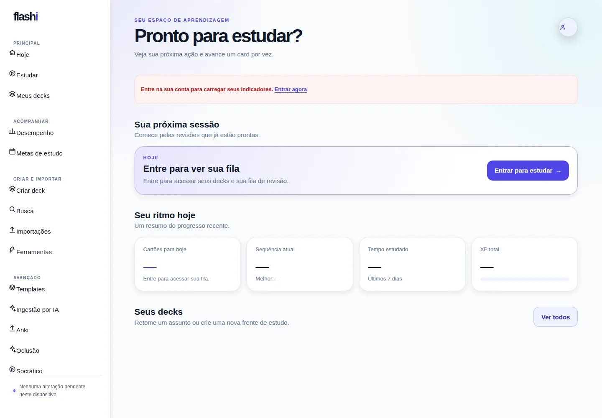

### Textos e informações

- “Seu espaço de aprendizagem”.
- “Seu ritmo hoje”.
- **Cartões para hoje**, **Sequência atual**, **Tempo estudado** e **XP total**.
- “Continue estudando”.
- “Escolha um deck para começar”.
- “Seus decks”.
- “Desempenho nos últimos 7 dias”.

### Ações

- **Escolher um deck →:** leva à biblioteca de decks.
- **Ver todos:** também leva à biblioteca.
- **Criar meu primeiro deck:** abre o formulário de criação.
- **Avatar:** abre o perfil.

### Usabilidade

A página prioriza a decisão principal: escolher um deck e começar. Quando a conta ainda não possui dados, os números aparecem como zero e o estado vazio orienta o próximo passo sem inventar atividade.

## 5. Biblioteca de decks

**Rota:** `/decks`

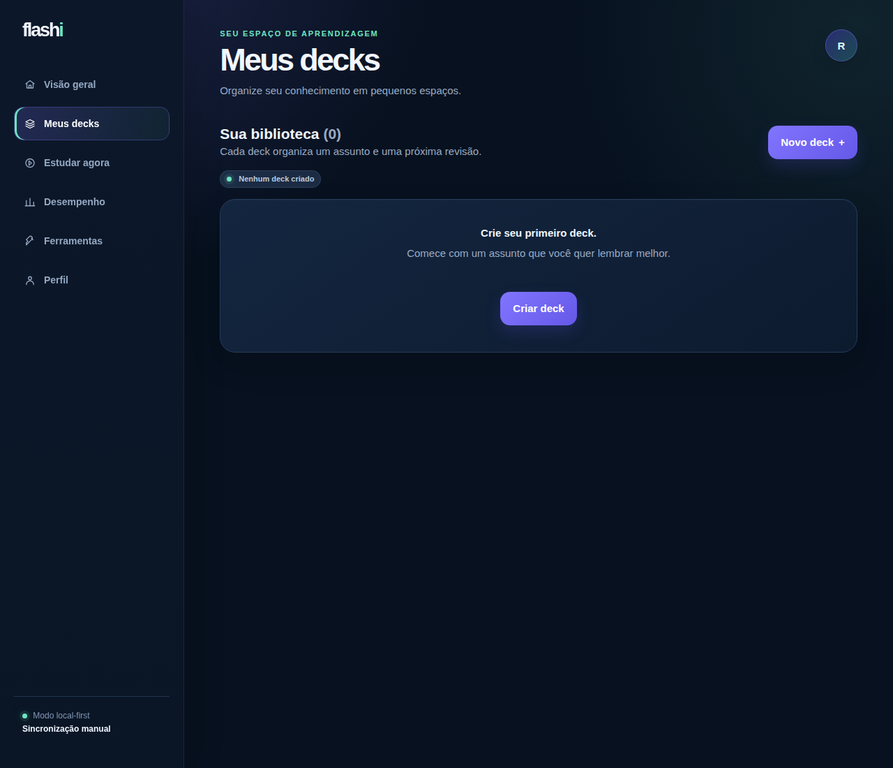

### Textos e controles

- Título **Meus decks**.
- “Organize seu conhecimento em pequenos espaços.”
- Indicador “Sua biblioteca (0)” no estado capturado.
- **Novo deck +**.
- Estado vazio: “Nenhum deck criado”.
- **Criar deck**.

### Fluxo recomendado

1. Acesse **Meus decks**.
2. Clique em **Novo deck +** ou **Criar deck**.
3. Preencha nome e descrição.
4. Salve o deck.
5. Abra o deck criado para gerenciar cards, notes, mídia e colaboração.

## 6. Criar um deck

**Rota:** `/decks/new`

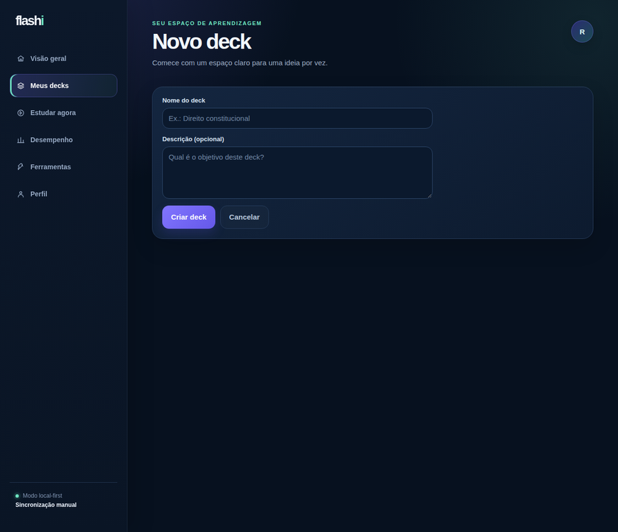

### Campos

- **Nome do deck:** obrigatório; placeholder “Ex.: Direito constitucional”.
- **Descrição (opcional):** textarea com placeholder “Qual é o objetivo deste deck?”.

### Botões

- **Criar deck:** valida o formulário e cria o deck no Supabase.
- **Cancelar:** abandona o formulário e retorna ao fluxo anterior.

### Usabilidade

O formulário é curto, com labels explícitos e foco por teclado. Use um nome específico, como “Farmacologia — antibióticos”, em vez de um nome genérico.

## 7. Detalhe do deck

**Rota:** `/decks/{DECK_ID}`

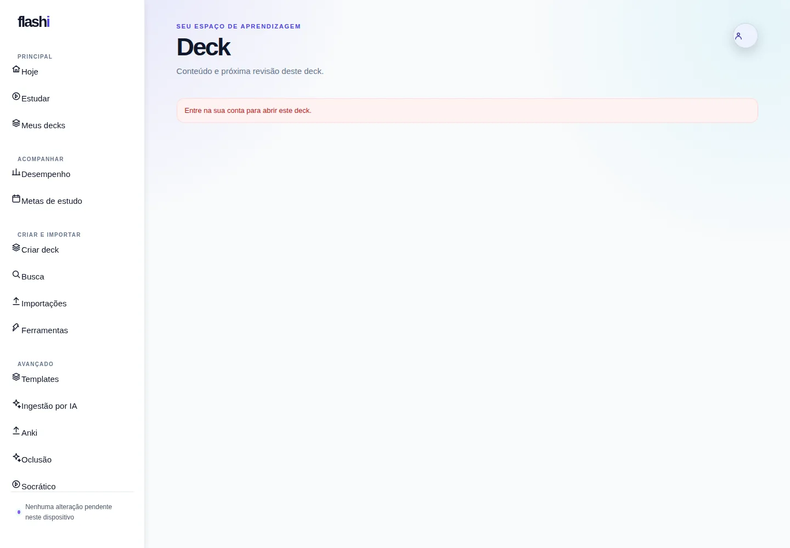

A captura utiliza um UUID vazio para documentar o estado de carregamento: **“Carregando deck…”**. Com um deck existente, a tela apresenta o resumo e as ações do deck.

### Ações disponíveis no detalhe

- **Gerenciar cards:** abre `/decks/{DECK_ID}/cards`.
- **Gerenciar notes:** abre `/decks/{DECK_ID}/notes`.
- **Estudar agora:** inicia a revisão do deck.
- **Colaboradores:** adiciona, lista, altera papel e remove colaboradores quando o recurso está habilitado.
- **Mídias:** permite upload, associação, visualização, edição e exclusão quando o recurso está habilitado.
- **Notes:** painel completo de conteúdo estruturado, descrito na seção 9.

## 8. Gerenciar cards

**Rota:** `/decks/{DECK_ID}/cards`

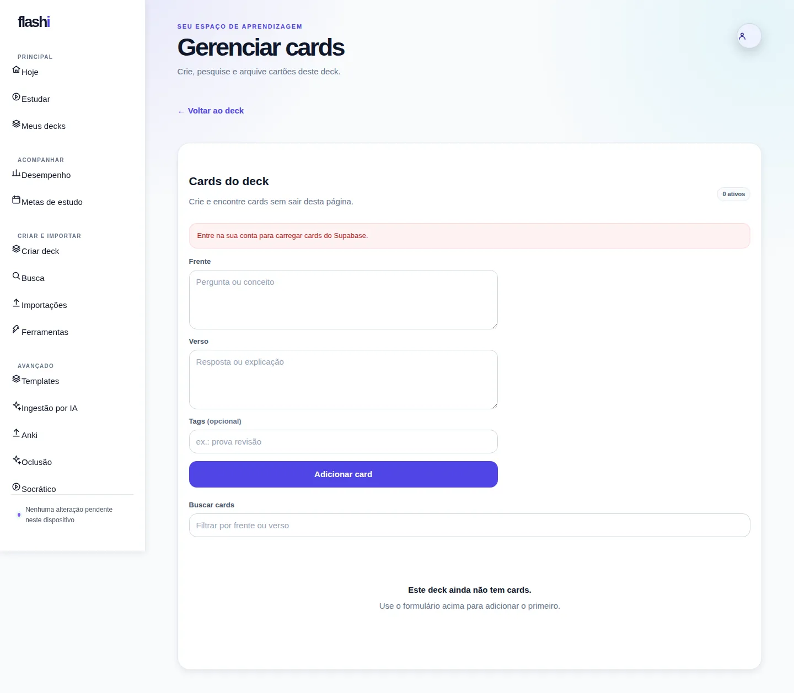

### Formulário de criação

- **Frente:** pergunta ou conceito.
- **Verso:** resposta ou explicação.
- **Tags (opcional):** tags separadas conforme o componente de tags.
- **Adicionar card:** grava o card e atualiza a lista.

### Pesquisa e manutenção

- **Buscar cards:** filtra por frente ou verso.
- Cards arquivados deixam de aparecer na lista ativa.
- O estado vazio informa: “Este deck ainda não tem cards. Use o formulário acima para adicionar o primeiro.”

### Usabilidade

Preencha a frente com uma pergunta que possa ser respondida sem ambiguidade. Use o verso para explicação curta, exemplo ou regra. Tags como `prova`, `revisão` e `difícil` ajudam a localizar o conteúdo.

## 9. Gerenciar notes — CRUD completo

**Rota:** `/decks/{DECK_ID}/notes`

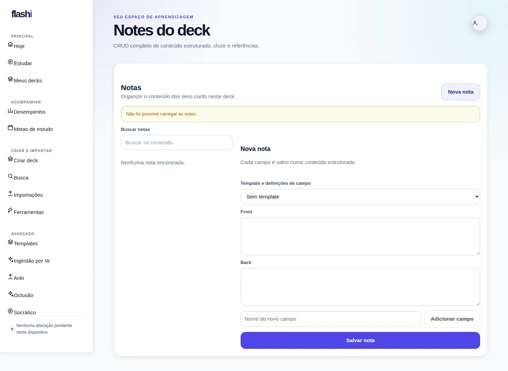

A tela também aparece dentro do detalhe do deck.

### Lista e pesquisa

- **Nova note:** limpa o editor e prepara uma nova note.
- **Buscar notes:** procura no conteúdo estruturado dos campos.
- A lista mostra a frente/título e a quantidade de campos.
- Selecionar uma note carrega seus dados para edição.

### Editor

- **Template e definições de campo:** permite selecionar um template disponível e carregar seus nomes de campo.
- **Front** e **Back:** campos iniciais para uma note básica.
- **Adicionar campo:** cria um campo personalizado, como `Exemplo`, `Fórmula`, `Fonte` ou `Contexto`.
- **Salvar note:** cria ou atualiza a note.
- **Excluir note:** remove a note por exclusão lógica, preservando o modelo de sincronização.

### Cloze deletions

Depois de salvar uma note existente, o editor apresenta:

- campo que contém o cloze;
- ordinal do cloze;
- dica opcional;
- **Adicionar cloze**;
- lista de clozes existentes;
- **Remover** para apagar um cloze específico.

### Referências

O editor de referências permite informar o ID da note relacionada, adicionar uma referência e remover uma referência existente. Uma note não pode referenciar a si mesma.

### Usabilidade

- Salve uma note antes de cadastrar clozes ou referências.
- Use nomes de campo estáveis; mudar `Front` para outro nome altera como o conteúdo é exibido.
- O estado vazio não cria conteúdo automaticamente: ele apresenta “Nenhuma note encontrada”.

## 10. Modo de estudo

### 10.1 Sessão demonstrativa

**Rota:** `/study/demo`

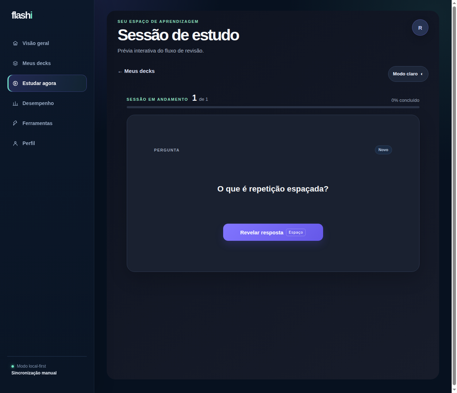

A sessão demonstrativa exibe “Prévia interativa do fluxo de revisão” e um card de exemplo:

- tipo **Pergunta**;
- badge **Novo**;
- pergunta “O que é repetição espaçada?”;
- **Revelar resposta Espaço**.

O botão pode ser acionado com o mouse ou pela tecla **Espaço**.

### 10.2 Resposta revelada e avaliação

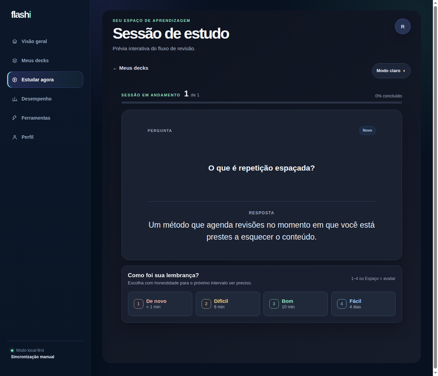

Após revelar, aparece:

- **Resposta** com a explicação;
- “Como foi sua lembrança?”;
- instrução “1–4 ou Espaço = avaliar”;
- **1 De novo**;
- **2 Difícil**;
- **3 Bom**;
- **4 Fácil**.

Cada botão informa o próximo intervalo, por exemplo “< 1 min”, “6 min”, “10 min” ou “4 dias”. Escolha honestamente: a avaliação alimenta o agendamento FSRS.

### 10.3 Controles visuais

- **Modo claro ◐:** alterna o tema da sessão.
- **← Meus decks:** retorna à biblioteca.
- Barra de progresso: informa posição e percentual concluído.

### 10.4 Deck sem cards

**Rota:** `/study/{DECK_ID}`

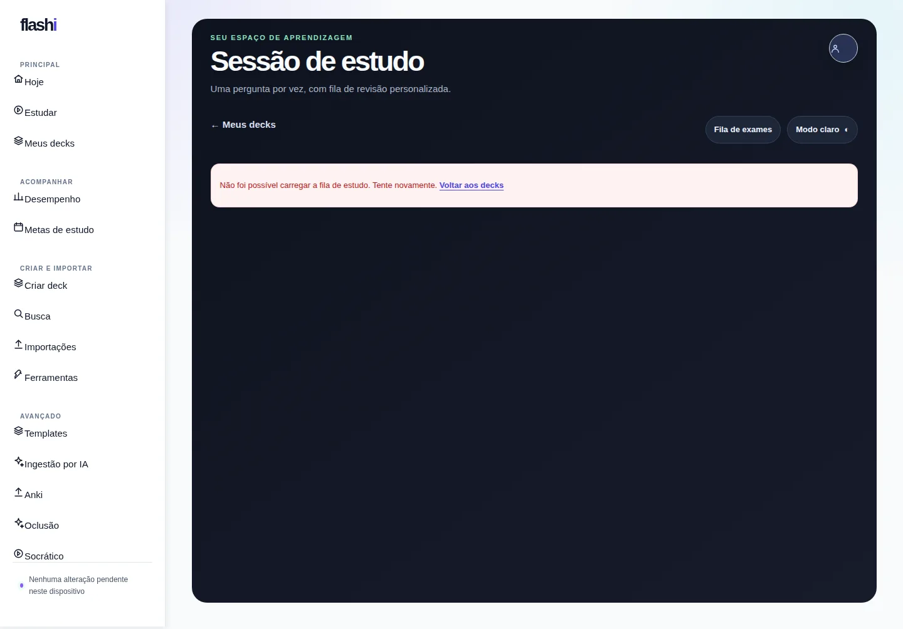

Quando não há cards para revisar, a tela informa **“Nenhum cartão para revisar agora.”** e oferece **Gerenciar cards**. Esse é o caminho correto para sair do estado vazio.

## 11. Desempenho

**Rota:** `/analytics`

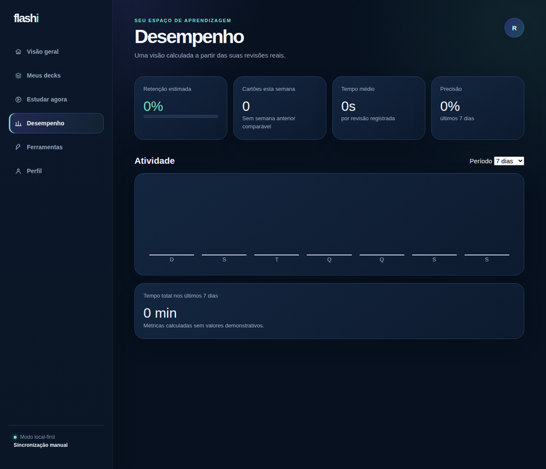

### Métricas

- **Retenção estimada**.
- **Cartões esta semana**.
- **Tempo médio** por revisão registrada.
- **Precisão**.
- Gráfico de **Atividade**.
- **Tempo total nos últimos 7 dias**.

### Controle

O seletor de período oferece **7 dias**, **30 dias** e **90 dias**. A página informa quando não há valores demonstrativos e calcula as métricas a partir de revisões reais.

## 12. Ferramentas avançadas

**Rota:** `/tools`

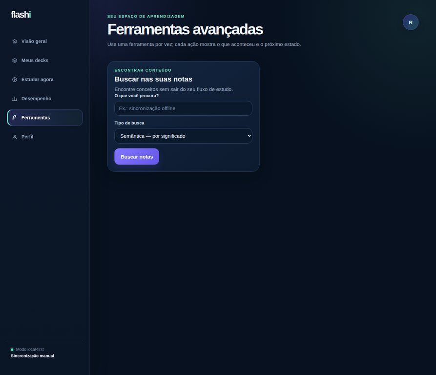

### Busca de conteúdo

- Campo **O que você procura?**.
- Placeholder “Ex.: sincronização offline”.
- Seletor **Tipo de busca**:
  - **Semântica — por significado**;
  - **Literal — por palavras**.
- **Buscar notas**.

Digite um conceito, escolha o modo e execute a busca. O modo semântico depende dos embeddings disponíveis; o modo literal procura correspondência por palavras.

## 13. Busca semântica dedicada

**Rota:** `/search`

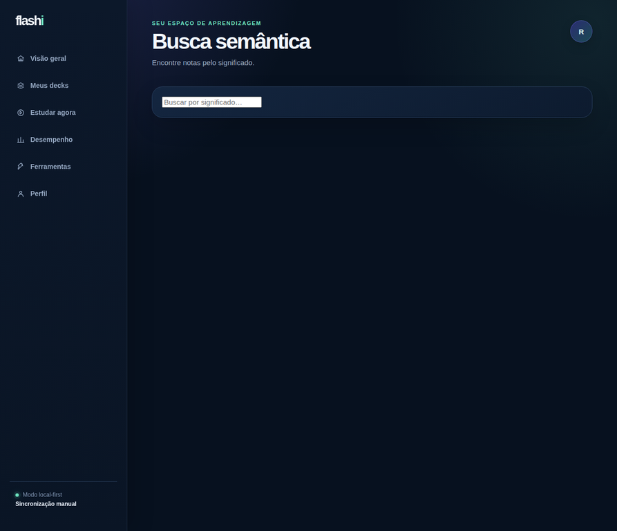

A página apresenta o título **Busca semântica**, a descrição “Encontre notas pelo significado” e um campo **Buscar por significado…**. Digite uma pergunta ou conceito, envie e examine os resultados pelo grau de similaridade.

A rota `/study/search` possui a mesma finalidade, mas no ambiente capturado estava desativada por feature flag:

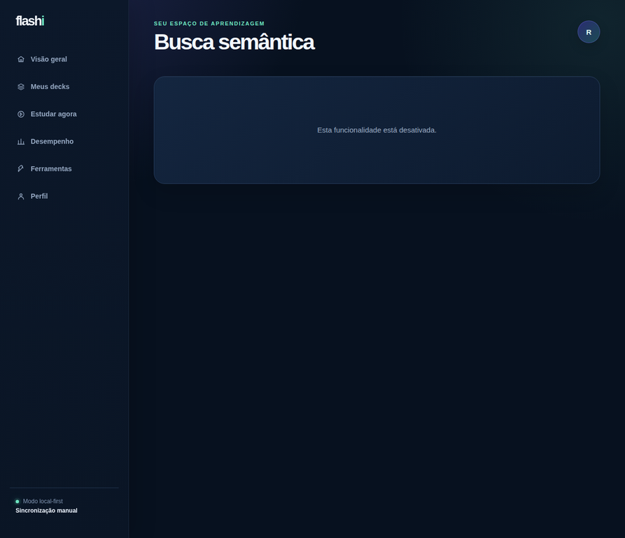

## 14. Perfil e preferências

**Rota:** `/profile`

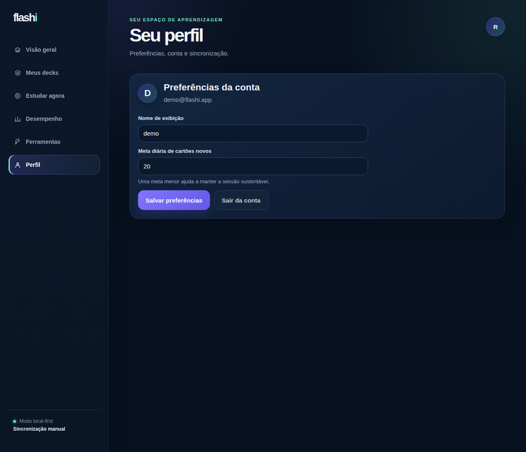

### Campos

- **Nome de exibição**.
- **Meta diária de cartões novos**.

### Botões

- **Salvar preferências:** grava as alterações.
- **Sair da conta:** encerra a sessão Supabase.

A descrição “Uma meta menor ajuda a manter a sessão sustentável” orienta a escolha. Recomenda-se começar com uma meta que possa ser cumprida diariamente.

## 15. Autenticação

### Login

**Rota:** `/login`

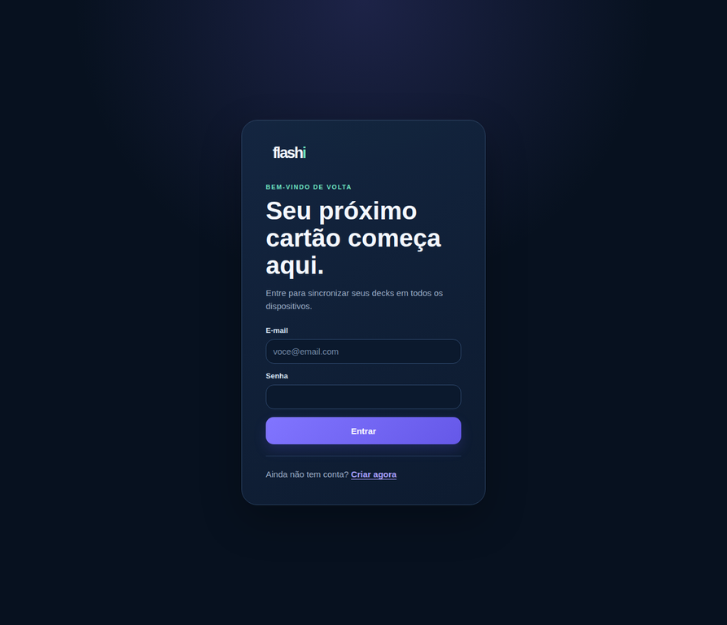

- **E-mail** — placeholder `voce@email.com`.
- **Senha**.
- **Entrar**.
- **Criar agora** — leva ao cadastro.

Texto principal: “Seu próximo cartão começa aqui.” A tela explica que o login sincroniza decks em todos os dispositivos.

### Cadastro

**Rota:** `/register`

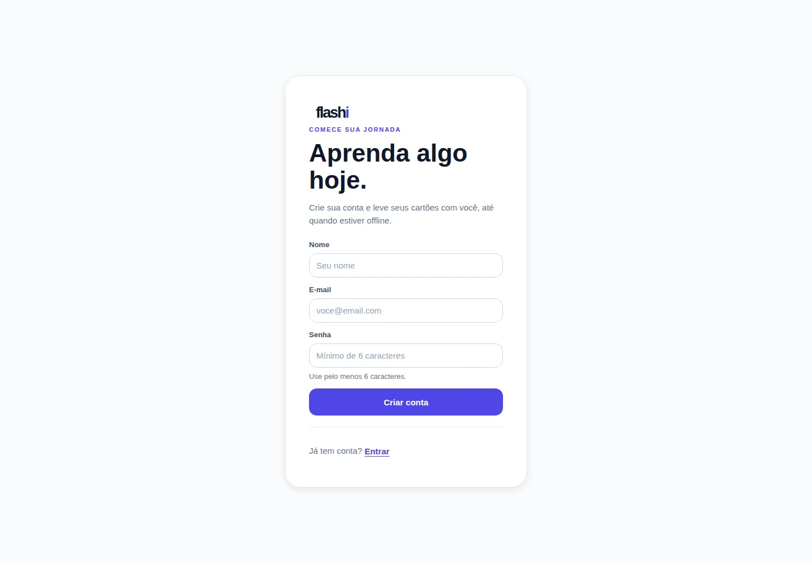

- **Nome** — placeholder “Seu nome”.
- **E-mail**.
- **Senha** — mínimo de 6 caracteres.
- **Criar conta**.
- **Entrar** — retorna ao login.

## 16. Importação e exportação

### Importar do Anki

**Rota:** `/import/anki`

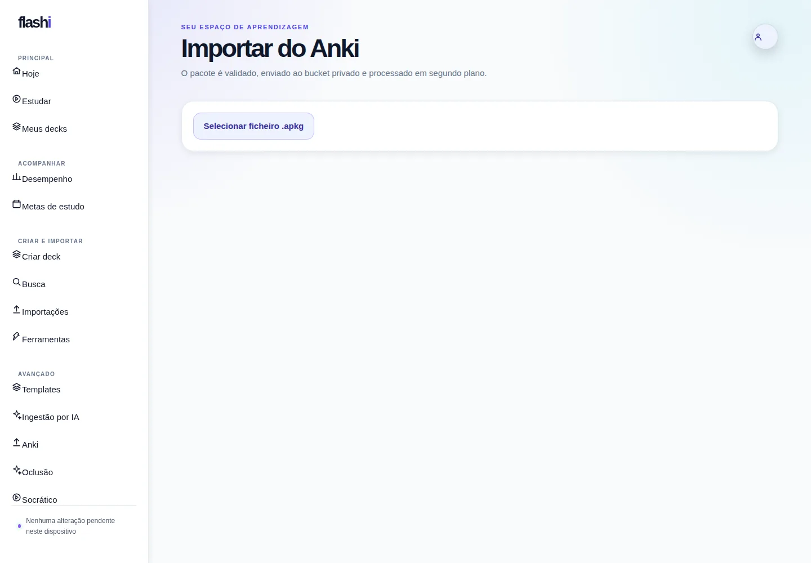

No ambiente documentado, a tela apresenta **“Esta funcionalidade está desativada.”**. O botão não é exibido enquanto a feature flag estiver desligada.

### Exportar Anki

**Rota:** `/export/anki`

Também aparece como desativada no ambiente capturado. Não tente enviar arquivos enquanto a tela informar esse estado.

### Importar por URL

**Rota:** `/import/url`

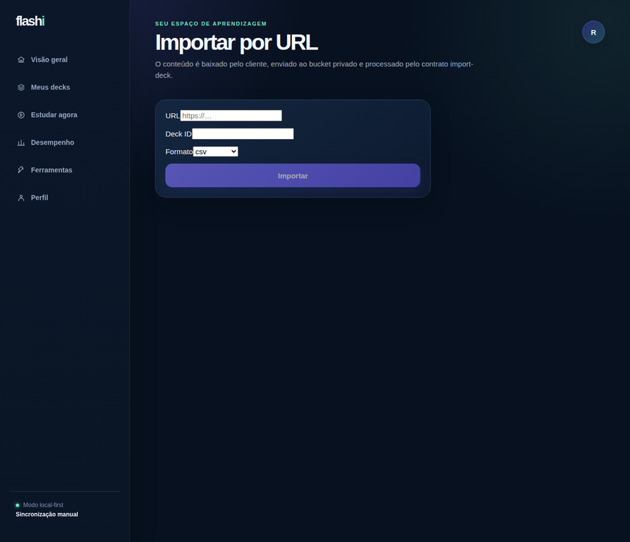

Campos e controles:

- **URL** — placeholder `https://…`.
- **Deck ID**.
- **Formato** — `csv`, `markdown`, `quizlet` ou `remnote`.
- **Importar**.

O texto informa que o conteúdo é baixado pelo cliente, enviado ao bucket privado e processado pelo contrato `import-deck`. Confirme sempre a origem da URL antes de importar.

### Ingestão por IA

**Rota:** `/import/ai-ingest`

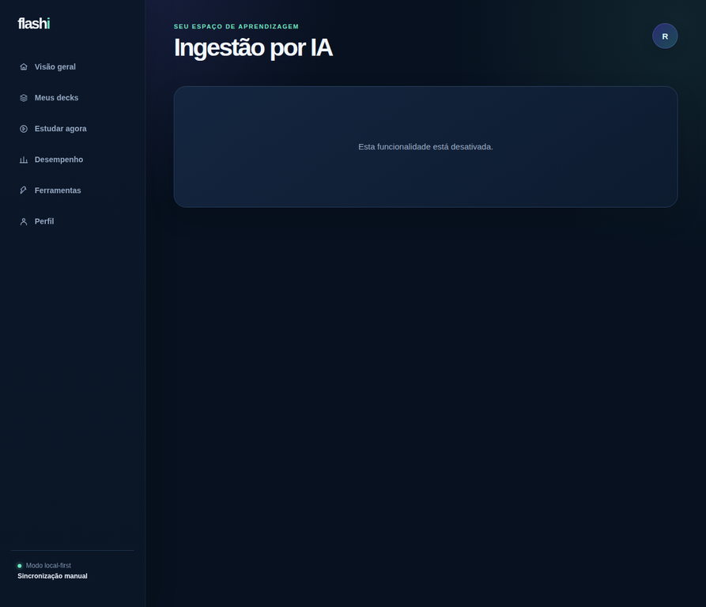

A funcionalidade aparece desativada no ambiente documentado. Quando habilitada, o fluxo suporta escolha do deck, texto-fonte e acompanhamento de jobs sem salvar sugestões sem revisão humana.

## 17. Workers e operações assíncronas

### Otimização FSRS

**Rota:** `/settings/fsrs-optimize`

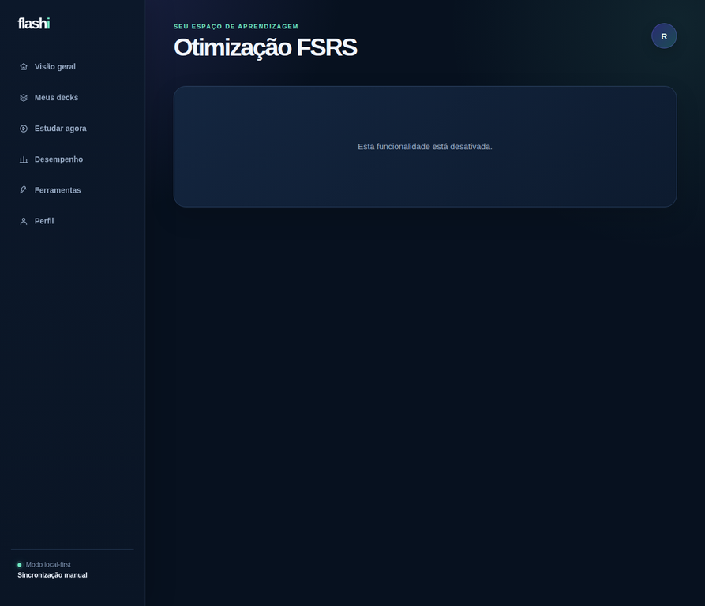

No ambiente capturado, a feature está desativada. Quando habilitada, o fluxo permite solicitar a otimização baseada no histórico real de revisões, acompanhar o job e solicitar nova execução para falhas.

### Auditoria MCP

**Rota:** `/tools/mcp`

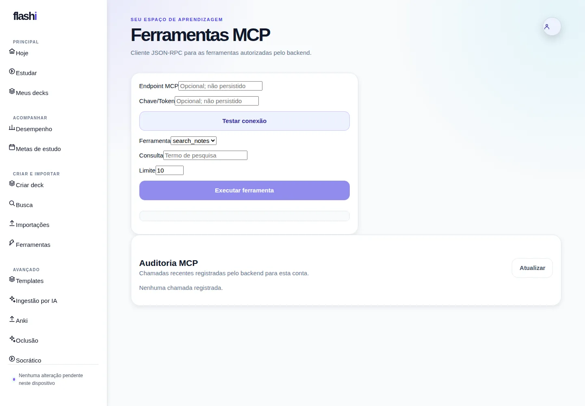

Controles:

- **Endpoint MCP:** opcional e não persistido.
- **Chave/Token:** opcional e não persistido; não compartilhe tokens no manual ou em chamados.
- **Testar conexão**.
- **Ferramenta:** `search_notes` ou `create_note`.
- **Consulta** e **Limite** para `search_notes`.
- **Deck ID**, **Frente** e **Verso** para `create_note`.
- **Executar ferramenta**.
- **Atualizar** auditoria.

A seção **Auditoria MCP** mostra ferramenta, número de resultados, data e request ID. O backend só expõe as operações autorizadas.

## 18. Recursos com feature flag desativada

As capturas abaixo registram o comportamento esperado quando uma funcionalidade está desabilitada. A aplicação preserva a navegação, mas não expõe ações que não podem ser executadas.

| Recurso | Rota | Captura |
|---|---|---|
| Templates | `/templates` | [07-templates-desativado.webp](./07-templates-desativado.webp) |
| Oclusão de imagem | `/occlusion` | [16-oclusao-desativada.webp](./16-oclusao-desativada.webp) |
| Conquistas | `/profile/badges` | [17-conquistas-desativada.webp](./17-conquistas-desativada.webp) |
| Sessões socráticas | `/socratic` | [24-sessoes-socraticas.webp](./24-sessoes-socraticas.webp) |
| Sessão socrática individual | `/socratic/{ID}` | [28-detalhe-socratico.webp](./28-detalhe-socratico.webp) |
| Mídia individual | `/media/{ID}` | [26-media-desativada.webp](./26-media-desativada.webp) |
| Template individual | `/templates/{ID}` | [27-detalhe-template.webp](./27-detalhe-template.webp) |
| Oclusão nova | `/decks/{ID}/occlusion/new` | [23-nova-oclusao.webp](./23-nova-oclusao.webp) |

O texto **“Esta funcionalidade está desativada.”** é preferível a mostrar botões quebrados: o usuário sabe que não é um erro de preenchimento.

## 19. Guia de usabilidade e acessibilidade

### Teclado

- Use **Tab** para percorrer links, inputs, selects e botões.
- Use **Enter** em links e formulários quando o foco estiver no controle.
- No estudo demonstrativo, **Espaço** revela a resposta e as teclas **1–4** avaliam a lembrança.
- O link **Pular para o conteúdo principal** permite ignorar a barra lateral.

### Formulários

- Leia sempre a label antes de preencher.
- Campos obrigatórios têm validação HTML ou validação de serviço.
- Mensagens de sucesso e erro aparecem em regiões de status.
- Evite colar tokens, chaves ou dados privados em campos que não são persistidos.

### Navegação segura

- Para criar conteúdo, use primeiro um deck.
- Para cloze, referências e mídia, salve ou selecione a note/card antes.
- Em estados vazios, siga o botão sugerido em vez de recarregar repetidamente.
- Em imports, valide URL, formato e deck de destino.

### Feedback visual

- Botões principais usam a cor roxa do produto.
- Botões secundários e ghost representam ações auxiliares.
- Badges e mensagens de status mostram o próximo intervalo ou o resultado da ação.
- A aplicação evita dados fictícios em métricas e listas.

## 20. Fluxo completo recomendado

1. Crie uma conta em **Criar agora**.
2. Entre com e-mail e senha.
3. Crie um deck em **Meus decks → Novo deck**.
4. Abra **Gerenciar cards** e adicione um primeiro card.
5. Abra **Gerenciar notes** para estruturar campos, templates, clozes e referências.
6. Adicione mídia a um card, quando o recurso estiver habilitado.
7. Clique em **Estudar agora**.
8. Revele a resposta e escolha de 1 a 4.
9. Consulte **Desempenho** para acompanhar retenção, precisão e tempo.
10. Ajuste a meta diária no **Perfil**.
11. Use **Ferramentas** e **Auditoria MCP** apenas quando necessário.

## 21. Inventário de capturas

Foram salvos **31 screenshots** nesta pasta, cobrindo visão geral, autenticação, decks, cards, notes, estudo, métricas, ferramentas, importações, estados vazios e recursos desativados.

Todos os arquivos de imagem são relativos a este manual para que o documento permaneça portável dentro do repositório.
