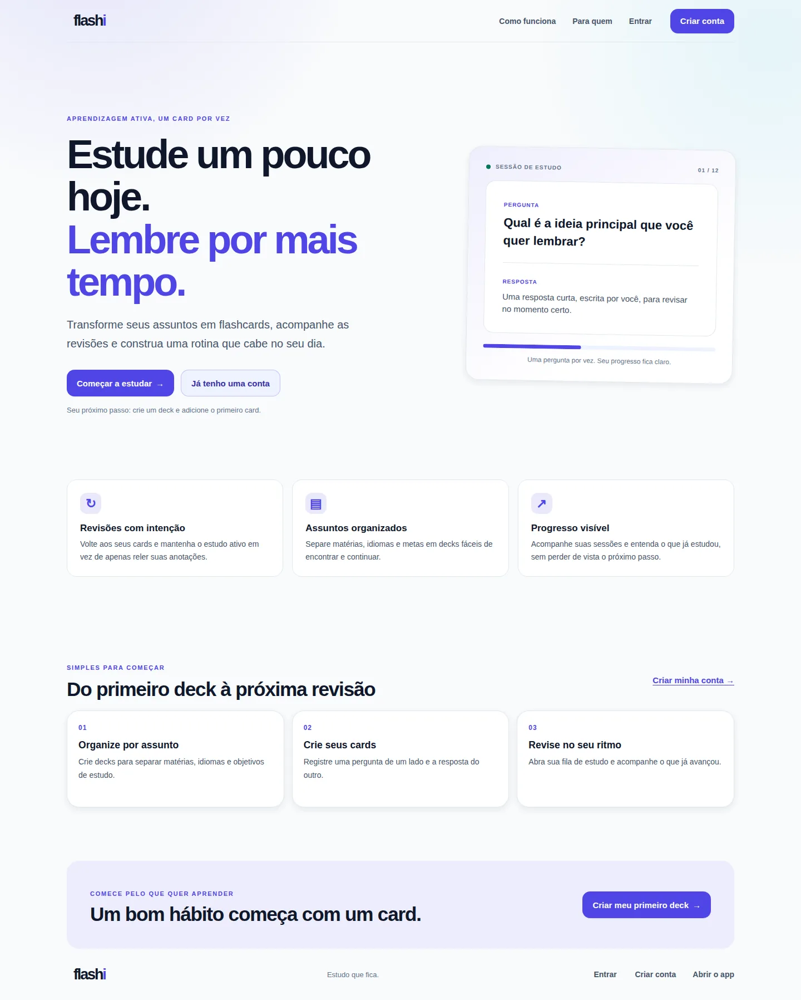
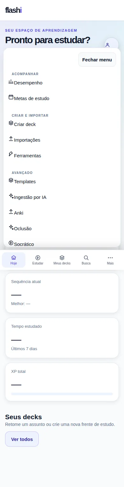
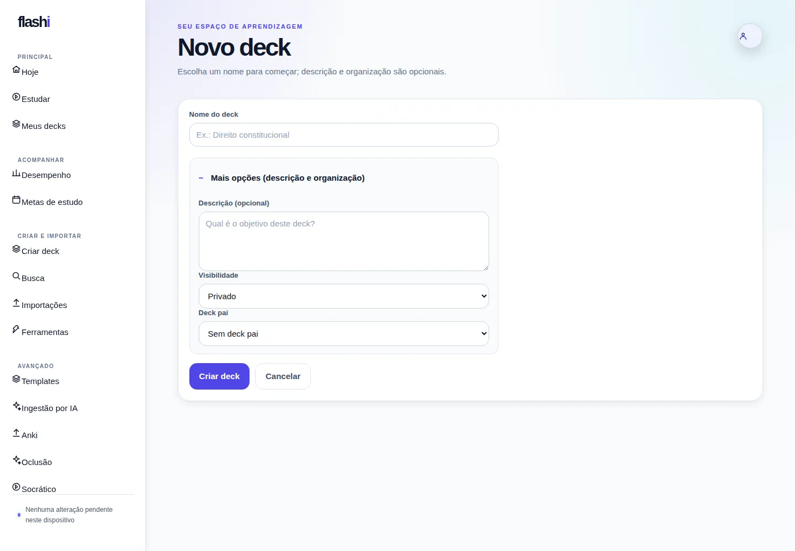
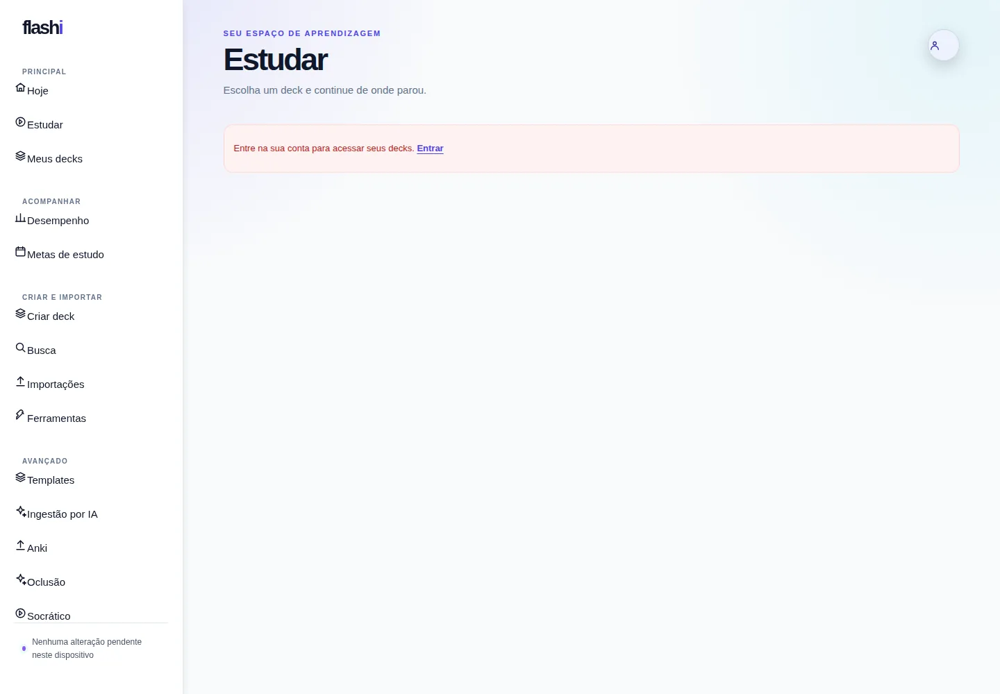
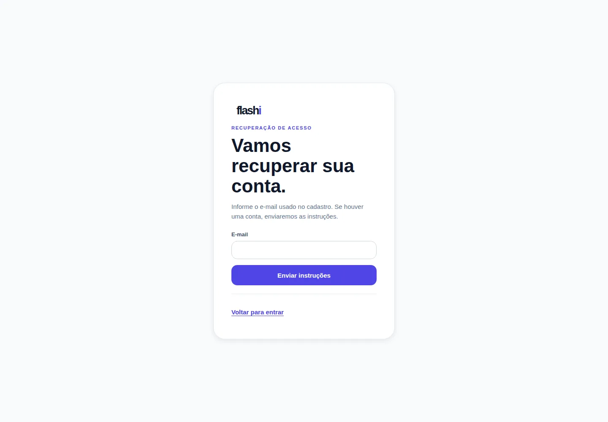
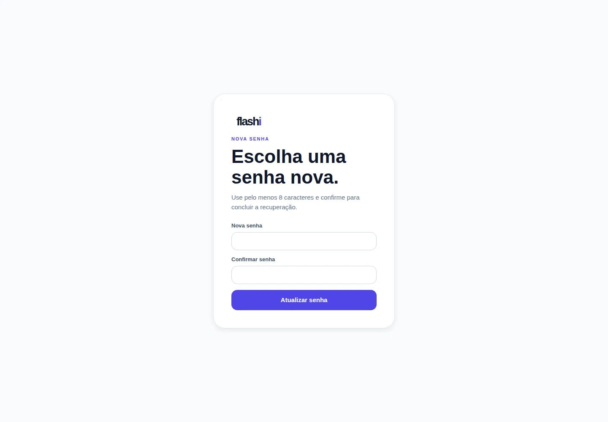

# Manual do usuário — Flashi

**Versão documentada:** branch `feat/sdd-activation` (frontend `4a03419`; backend `Flashi/feat/sdd-activation`)
**Ambiente usado:** frontend executado localmente em `http://127.0.0.1:3000`, sem sessão autenticada
**Base das capturas:** `http://localhost:3000` (os prints não dependem de credenciais reais)
**Data da captura:** 03/10/2026 — rodada geral de QA executada em 04/10/2026

## 1. Sobre este manual

Este manual descreve a navegação, os textos apresentados, os botões, os campos de formulário, os estados vazios e a usabilidade observada na aplicação Flashi. As capturas foram feitas na aplicação em execução e estão armazenadas nesta mesma pasta `docs`.

> **Importante:** algumas páginas dependem de autenticação, de um deck válido ou de dados reais. As capturas públicas foram feitas sem sessão de usuário. Quando a página exige login, deck ou ID real, o manual identifica a limitação; isso não significa que o recurso esteja desativado.

> **Limite desta validação:** a rodada de 04/10/2026 confirmou a interface local e seus estados sem sessão. Não foram fornecidos credenciais de homologação nem URL de staging; portanto, login real, persistência, envio de e-mail, uploads, jobs e respostas do Supabase não foram confirmados nesta rodada. Operações que alteram dados foram deliberadamente evitadas.

## 2. Conceitos básicos

- **Deck:** coleção de estudo sobre um assunto.
- **Card:** cartão de revisão com frente, verso e tags.
- **Note:** conteúdo estruturado que pode originar um ou mais cards.
- **Repetição espaçada:** agenda revisões para o momento em que o conteúdo tende a ser esquecido.
- **FSRS:** algoritmo de agendamento e otimização das revisões.
- **Modo local-first:** parte dos dados pode ser armazenada localmente; status e ações de sincronização só aparecem quando o worker está habilitado.
- **Estado vazio:** tela que explica o que falta fazer, sem apresentar dados fictícios.

## 3. Navegação global

### Pré-requisitos de acesso

- Para conhecer o produto, basta abrir `/`; não é necessário criar conta para ver a landing ou iniciar a demonstração em `/study/demo`.
- Para manter decks, cards, perfil, fila de estudo e progresso sincronizados, crie uma conta em `/register`, confirme o e-mail se o provedor solicitar e entre em `/login`.
- O projeto precisa estar conectado ao Supabase para autenticação e gravação remota. Se a conexão não estiver configurada, siga o aviso apresentado; não interprete esse estado como uma biblioteca vazia.
- Em telas estreitas, use a barra inferior para **Hoje**, **Estudar**, **Meus decks** e **Busca**; abra **Mais** para as demais áreas. `Escape` fecha o menu.

A barra lateral aparece nas páginas autenticadas e apresenta:

| Item | Destino | Uso |
|---|---|---|
| `flashi` | `/dashboard` | Volta ao painel. |
| **Hoje** | `/dashboard` | Mostra próximo passo, fila, sequência, estatísticas e decks. |
| **Meus decks** | `/decks` | Lista, cria e acessa decks. |
| **Estudar** | `/study` ou `/study/{DECK_ID}` | Escolhe deck antes de iniciar uma sessão. |
| **Desempenho** | `/analytics` | Mostra métricas e atividade por período. |
| **Ferramentas** | `/tools` | Busca conteúdo e acessa recursos avançados. |
| **Perfil** | `/profile` | Edita preferências e encerra a sessão. |
| Avatar com inicial | `/profile` | Atalho para o perfil. |

No desktop, as áreas ficam agrupadas. No mobile, Hoje, Estudar, Meus decks e Busca aparecem na barra inferior; as demais opções ficam em **Mais**, fechável com Esc. A caixa de sincronização mostra online/offline, pendências e ações quando disponíveis.

### Página pública

**Rota:** `/`

Visitantes veem os benefícios e os passos iniciais; os links **Criar conta** e **Entrar** levam para autenticação. O link **Abrir o app** leva ao painel em `/dashboard`. Não é necessário login para ler essa página.

### Menu móvel

A barra inferior mantém quatro destinos e um botão **Mais**. Toque para ver perfil, desempenho, ferramentas e sincronização; **Fechar menu** ou **Esc** fecha o painel.

## 4. Visão geral

**Rota:** `/dashboard`

### Textos e informações

- “Pronto para estudar?”.
- “Sua próxima sessão” e “Seu ritmo hoje”.
- **Cartões para hoje**, **Sequência atual**, **Tempo estudado** e **XP total**.
- Para visitantes, o painel explica que é preciso entrar para carregar a fila e os indicadores.
- “Seus decks”.
- “Desempenho nos últimos 7 dias”.

### Ações

- **Entrar para estudar →:** leva ao login enquanto não há sessão; com uma conta, abre a próxima fila elegível.
- **Ver todos:** também leva à biblioteca.
- **Criar meu primeiro deck:** aparece após login quando a conta realmente não tem decks e abre o formulário de criação.
- **Avatar:** abre o perfil.

### Usabilidade

A página prioriza o próximo passo com base na fila real. Para visitantes, mostra “Entre para ver sua fila” e “Entre para acessar sua fila”, sem afirmar que a pessoa tem zero revisões; o botão **Entrar para estudar** leva ao login.

## 5. Biblioteca de decks

**Rota:** `/decks`

### Textos e controles

- Título **Meus decks**.
- “Organize seu conhecimento em pequenos espaços.”
- A captura sem sessão mostra “Sua biblioteca (—)” e solicita login, sem confundir falta de sessão com biblioteca vazia.
- **Novo deck +** continua visível; para listar, criar ou alterar dados, entre na conta.
- Após autenticação, uma biblioteca realmente vazia apresenta o estado vazio e o botão **Criar deck**.

### Fluxo recomendado

1. Acesse **Meus decks** e entre na conta para carregar sua biblioteca.
2. Clique em **Novo deck +** ou **Criar deck**.
3. Preencha o nome; descrição e organização são opcionais em **Mais opções**.
4. Salve o deck.
5. Abra o deck criado para gerenciar cards, notes, mídia e colaboração.

## 6. Criar um deck

**Rota:** `/decks/new`

Campos de organização e descrição são opcionais e ficam recolhidos até selecionar **Mais opções (descrição e organização)**.

### Campos

- **Nome do deck:** obrigatório; placeholder “Ex.: Direito constitucional”.
- **Descrição (opcional):** textarea com placeholder “Qual é o objetivo deste deck?”.

### Botões

- **Criar deck:** valida o formulário e cria o deck no Supabase.
- **Cancelar:** abandona o formulário e retorna ao fluxo anterior.

### Usabilidade

O formulário é curto, com labels explícitos e foco por teclado. Use um nome específico, como “Farmacologia — antibióticos”, em vez de um nome genérico.

## 7. Detalhe do deck

**Rota:** `/decks/{DECK_ID}`

A captura documenta o estado sem sessão: **“Entre na sua conta para abrir este deck.”**. Com um identificador válido e sessão autenticada, a tela apresenta o resumo e as ações do deck.

### Ações disponíveis no detalhe

- **Gerenciar cards:** abre `/decks/{DECK_ID}/cards`.
- **Gerenciar notes:** abre `/decks/{DECK_ID}/notes`.
- **Estudar agora:** inicia a revisão do deck.
- **Colaboradores:** adiciona, lista, altera papel e remove colaboradores quando o recurso está habilitado.
- **Mídias:** permite upload, associação, visualização, edição e exclusão quando o recurso está habilitado.
- **Notes:** painel completo de conteúdo estruturado, descrito na seção 9.

## 8. Gerenciar cards

**Rota:** `/decks/{DECK_ID}/cards`

### Formulário de criação

- **Frente:** pergunta ou conceito.
- **Verso:** resposta ou explicação.
- **Tags (opcional):** tags separadas conforme o componente de tags.
- **Adicionar card:** grava o card e atualiza a lista.

### Pesquisa e manutenção

- **Buscar cards:** filtra por frente ou verso.
- Cards arquivados deixam de aparecer na lista ativa.
- O estado vazio informa: “Este deck ainda não tem cards. Use o formulário acima para adicionar o primeiro.”

### Usabilidade

Preencha a frente com uma pergunta que possa ser respondida sem ambiguidade. Use o verso para explicação curta, exemplo ou regra. Tags como `prova`, `revisão` e `difícil` ajudam a localizar o conteúdo.

## 9. Gerenciar notes — CRUD completo

**Rota:** `/decks/{DECK_ID}/notes`

A tela também aparece dentro do detalhe do deck.

### Lista e pesquisa

- **Nova note:** limpa o editor e prepara uma nova note.
- **Buscar notes:** procura no conteúdo estruturado dos campos.
- A lista mostra a frente/título e a quantidade de campos.
- Selecionar uma note carrega seus dados para edição.

### Editor

- **Template e definições de campo:** permite selecionar um template disponível e carregar seus nomes de campo.
- **Front** e **Back:** campos iniciais para uma note básica.
- **Adicionar campo:** cria um campo personalizado, como `Exemplo`, `Fórmula`, `Fonte` ou `Contexto`.
- **Salvar note:** cria ou atualiza a note.
- **Excluir note:** remove a note por exclusão lógica, preservando o modelo de sincronização.

### Cloze deletions

Depois de salvar uma note existente, o editor apresenta:

- campo que contém o cloze;
- ordinal do cloze;
- dica opcional;
- **Adicionar cloze**;
- lista de clozes existentes;
- **Remover** para apagar um cloze específico.

### Referências

O editor de referências permite informar o ID da note relacionada, adicionar uma referência e remover uma referência existente. Uma note não pode referenciar a si mesma.

### Usabilidade

- Salve uma note antes de cadastrar clozes ou referências.
- Use nomes de campo estáveis; mudar `Front` para outro nome altera como o conteúdo é exibido.
- O estado vazio não cria conteúdo automaticamente: ele apresenta “Nenhuma note encontrada”.

## 10. Modo de estudo

### 10.1 Escolher um deck e iniciar a sessão

**Rota:** `/study`

A rota lista seus decks. Em uma conta recém-criada, crie o primeiro deck antes de iniciar a revisão. A prévia demonstrativa fica em `/study/demo` e apresenta um card de exemplo:

- tipo **Pergunta**;
- badge **Novo**;
- pergunta “O que é repetição espaçada?”;
- **Revelar resposta Espaço**.

O botão pode ser acionado com o mouse ou pela tecla **Espaço**.

### 10.2 Resposta revelada e avaliação

Após revelar, aparece:

- **Resposta** com a explicação;
- “Como foi sua lembrança?”;
- instrução de teclado: **Espaço** revela; teclas **1–4** avaliam a resposta;
- **1 De novo**;
- **2 Difícil**;
- **3 Bom**;
- **4 Fácil**.

A interface não promete intervalos fixos: o agendador FSRS real calcula o próximo passo a partir do histórico e das configurações.

### 10.3 Controles visuais

- **Modo claro ◐:** alterna o tema da sessão.
- **← Meus decks:** retorna à biblioteca.
- Barra de progresso: informa posição e percentual concluído.

### 10.4 Deck sem cards

**Rota:** `/study/idiomas` (captura sem sessão de teste)

A captura anônima pode pedir login antes de consultar a fila. Depois de entrar, quando não houver cards elegíveis, a tela informa o estado vazio e oferece um caminho para gerenciar os cards.

## 11. Desempenho

**Rota:** `/analytics`

### Métricas

- **Dias com estudo** nos últimos 7 dias.
- **Cartões esta semana**.
- **Tempo médio** por revisão registrada.
- **Precisão**, com comparação em pontos percentuais quando existe histórico anterior.
- Gráfico de **Atividade**.
- **Tempo total nos últimos 7 dias**.

### Controle

O seletor oferece **7 dias**, **30 dias** e **90 dias**. O gráfico tem tabela equivalente para leitura por tecnologia assistiva; o resumo compara volume e precisão com a semana anterior apenas quando há dados suficientes.

## 12. Ferramentas avançadas

**Rota:** `/tools`

### Busca de conteúdo

- Campo **O que você procura?**.
- Placeholder “Ex.: sincronização offline”.
- Seletor **Tipo de busca**:
  - **Semântica — por significado**;
  - **Literal — por palavras**.
- **Buscar notas**.

Digite um conceito, escolha o modo e execute a busca. O modo semântico depende dos embeddings disponíveis; o modo literal procura correspondência por palavras.

## 13. Busca semântica dedicada

**Rota:** `/search`

A página apresenta o título **Busca semântica**, a descrição “Encontre notas pelo significado” e um campo **Buscar por significado…**. Digite uma pergunta ou conceito, envie e examine os resultados pelo grau de similaridade.

A rota `/study/search` é uma busca relacionada ao estudo; telas com dados reais podem exigir login:

## 14. Perfil e preferências

**Rota:** `/profile`

Sem sessão, a página solicita login antes de exibir ou salvar dados de perfil. A captura mantém os controles locais de aparência disponíveis e não apresenta valores padrão como se fossem preferências carregadas.

Após entrar, o formulário inclui nome de exibição, fuso horário e limites diários; as configurações avançadas de repetição espaçada ficam recolhidas. **Guardar preferências** salva as alterações; **Sair da conta** encerra a sessão e retorna à página pública.

Comece com uma meta diária realista e ajuste parâmetros avançados somente quando conhecer seus efeitos.

## 15. Autenticação

### Login

**Rota:** `/login`

- **E-mail** — placeholder `voce@email.com`.
- **Senha**, com controle para mostrar/ocultar.
- **Entrar**.
- **Esqueci minha senha** — abre a recuperação.
- **Criar conta** — leva ao cadastro.

Texto principal: “Seu próximo cartão começa aqui.” A tela explica que o login sincroniza decks em todos os dispositivos.

### Cadastro

**Rota:** `/register`

- **Nome** — placeholder “Seu nome”.
- **E-mail**.
- **Senha** — mínimo de 6 caracteres.
- **Criar conta**.
- Após o cadastro, verifique o e-mail para confirmar o acesso.
- **Entrar** — retorna ao login.

## 16. Recuperação de senha

### Solicitar link

**Rota:** `/forgot-password`

Informe o e-mail; a mensagem de sucesso não revela se uma conta existe. O envio real depende do provedor de e-mail configurado no Supabase.

### Definir senha nova

**Rota:** `/reset-password`

Abra pelo link recebido, digite e confirme uma senha com pelo menos 8 caracteres. Mensagens de link expirado/inválido direcionam a solicitar outro link. O domínio de retorno precisa ser autorizado no Supabase Authentication → URL Configuration.

## 17. Importação e exportação

### Importar do Anki

**Rota:** `/import/anki`

A tela permite escolher um pacote `.apkg`; enviar arquivo é uma operação externa, não executada durante a auditoria. Se a flag estiver desligada, a rota informa isso sem apresentar controles inativos.

### Exportar Anki

**Rota:** `/export/anki`

A rota exige deck e sessão para exportar; nenhum job de exportação foi disparado pela suíte.

### Importar por URL

**Rota:** `/import/url`

Campos e controles:

- **URL** — placeholder `https://…`.
- **Deck ID**.
- **Formato** — `csv`, `markdown`, `quizlet` ou `remnote`.
- **Importar**.

O texto informa que o conteúdo é baixado pelo cliente, enviado ao bucket privado e processado pelo contrato `import-deck`. Confirme sempre a origem da URL antes de importar.

### Ingestão por IA

**Rota:** `/import/ai-ingest`

O fluxo permite selecionar deck e informar texto-fonte quando há sessão e contratos disponíveis; nenhuma tarefa de ingestão foi enviada na auditoria.

## 18. Workers e operações assíncronas

### Otimização FSRS

**Rota:** `/settings/fsrs-optimize`

A rota depende de autenticação e do serviço de otimização. Não foi solicitado job remoto durante a auditoria.

### Auditoria MCP

**Rota:** `/tools/mcp`

Controles:

- **Endpoint MCP:** opcional e não persistido.
- **Chave/Token:** opcional e não persistido; não compartilhe tokens no manual ou em chamados.
- **Testar conexão**.
- **Ferramenta:** `search_notes` ou `create_note`.
- **Consulta** e **Limite** para `search_notes`.
- **Deck ID**, **Frente** e **Verso** para `create_note`.
- **Executar ferramenta**.
- **Atualizar** auditoria.

A seção **Auditoria MCP** mostra ferramenta, número de resultados, data e request ID. O backend só expõe as operações autorizadas.

## 19. Estados sem sessão e recursos condicionais

As capturas abaixo foram feitas sem credenciais de uma conta de teste. Rotas que precisam de sessão, deck ou ID real exibem login, estado vazio ou mensagem de erro. Isso não prova que a feature esteja desativada; ativação depende das flags e dos contratos do backend.

| Recurso | Rota | Captura |
|---|---|---|
| Templates | `/templates` | [07-templates-desativado.webp](./07-templates-desativado.webp) |
| Oclusão de imagem | `/occlusion` | [16-oclusao-desativada.webp](./16-oclusao-desativada.webp) |
| Conquistas | `/profile/badges` | [17-conquistas-desativada.webp](./17-conquistas-desativada.webp) |
| Sessões socráticas | `/socratic` | [24-sessoes-socraticas.webp](./24-sessoes-socraticas.webp) |
| Sessão socrática individual | `/socratic/{ID}` | [28-detalhe-socratico.webp](./28-detalhe-socratico.webp) |
| Mídia individual | `/media/{ID}` | [26-media-desativada.webp](./26-media-desativada.webp) |
| Template individual | `/templates/{ID}` | [27-detalhe-template.webp](./27-detalhe-template.webp) |
| Oclusão nova | `/decks/{ID}/occlusion/new` | [23-nova-oclusao.webp](./23-nova-oclusao.webp) |

Uma rota pode mostrar login, um estado vazio ou uma mensagem de recurso desativado. O estado é resultado da sessão/IDs/feature flags daquela execução; uma captura anônima não comprova indisponibilidade para uma conta autenticada.

## 20. Guia de usabilidade e acessibilidade

### Teclado

- Use **Tab** para percorrer links, inputs, selects e botões.
- Use **Enter** em links e formulários quando o foco estiver no controle.
- No estudo demonstrativo, **Espaço** revela a resposta e as teclas **1–4** avaliam a lembrança.
- O link **Pular para o conteúdo principal** permite ignorar a barra lateral.

### Formulários

- Leia sempre a label antes de preencher.
- Campos obrigatórios têm validação HTML ou validação de serviço.
- Mensagens de sucesso e erro aparecem em regiões de status.
- Evite colar tokens, chaves ou dados privados em campos que não são persistidos.

### Navegação segura

- Para criar conteúdo, use primeiro um deck.
- Para cloze, referências e mídia, salve ou selecione a note/card antes.
- Em estados vazios, siga o botão sugerido em vez de recarregar repetidamente.
- Em imports, valide URL, formato e deck de destino.

### Feedback visual

- Botões principais usam a cor roxa do produto.
- Botões secundários e ghost representam ações auxiliares.
- Badges e mensagens de status mostram o próximo intervalo ou o resultado da ação.
- A aplicação evita dados fictícios em métricas e listas.

## 21. Fluxo completo recomendado

1. Crie uma conta em **Criar conta** e confirme o e-mail, se solicitado.
2. Entre com e-mail e senha; para recuperar acesso use **Esqueci minha senha**.
3. Crie um deck em **Meus decks → Novo deck**.
4. Abra **Gerenciar cards** e adicione um primeiro card.
5. Abra **Gerenciar notes** para estruturar campos, templates, clozes e referências.
6. Adicione mídia a um card, quando o recurso estiver habilitado.
7. Clique em **Estudar agora**.
8. Revele a resposta e escolha de 1 a 4.
9. Consulte **Desempenho** para acompanhar dias estudados, volume, precisão e tempo.
10. Ajuste a meta diária no **Perfil**.
11. Use **Ferramentas** e **Auditoria MCP** apenas quando necessário.

## 22. Inventário de capturas

Foram atualizadas **31 capturas desktop** e adicionadas telas para landing pública, recuperação de senha, nova senha, menu móvel e opções avançadas de deck. Capturas mobile das mesmas telas estão em `screenshots/mobile/`; o inventário da execução está em `screenshots/capture-manifest.json`.

Todos os arquivos de imagem são relativos a este manual para manter o documento portável. As capturas mobile estão em `docs/screenshots/mobile/`; o script reproduzível é `scripts/capture-screens.mjs`.

## 23. Escopo do teste de interação

A revisão visitou todas as rotas documentadas em desktop, tablet e mobile, checou erros JavaScript, títulos, foco/nomes de controles e overflow; testou navegação pública, menu móvel, revelar/avaliar, campos opcionais, alternância de visibilidade da senha e validação de senhas divergentes. Por segurança, não enviou recuperação de e-mail, cadastro, login, arquivos, jobs, exportação nem comandos que gravariam/apagariam dados em Supabase. O fluxo autenticado depende de conta de homologação autorizada.

## 24. Registro da rodada geral — 04/10/2026

- **Playwright E2E:** 51 testes passaram; 1 teste de mutação autenticada foi ignorado porque `E2E_EMAIL` e `E2E_PASSWORD` não foram configurados.
- **Varredura exploratória:** as 38 rotas públicas/privadas e de demonstração responderam HTTP 200 no ambiente local anônimo; sem falhas de navegação, erros de console ou runtime, falhas reais de rede, respostas HTTP ≥ 400, chamadas acima de 2 s ou overflow horizontal no viewport desktop de 1280 px. A última rodada de produção registrou 4 prefetches RSC cancelados pelo Next durante a troca de rota (`ERR_ABORTED`), acompanhados separadamente como cancelamentos esperados.
- **Smoke visual/responsivo:** as 38 rotas passaram em quatro larguras e dois temas: 4.358 verificações de controles, 114 dropdowns e 304 títulos; sem overflow, erros JS, controles sem nome, opções sem texto ou alvos menores que 44 px.
- **Testes automatizados de unidade:** 34 passaram em 10 arquivos; `typecheck` passou; ESLint concluiu sem erros e reportou 17 avisos preexistentes.
- **Backend:** 26 migrações SQL passaram pelo parser local; a suíte de contrato passou com 10 testes e 198 subcasos.
- **Build:** `NEXT_PUBLIC_SITE_URL=https://flashi.example.invalid pnpm build` compilou 36 páginas estáticas e as rotas dinâmicas.
- **Reprodução:** `pnpm test:e2e`; `BASE_URL=http://127.0.0.1:3000 QA_OUTPUT=docs/qa-results-2026-10-04.json pnpm qa:exploratory`; `BASE_URL=http://127.0.0.1:3000 pnpm smoke:ui`; `pnpm test`; `pnpm typecheck`; `pnpm lint`; backend `python3 validate_sql.py` e `python3 -m pytest -q tests/test_contracts.py`.

O teste exploratório Playwright reutilizável está em `scripts/exploratory-qa.mjs`; os resultados completos por rota e a telemetria coletada estão em `docs/qa-results-2026-10-04.json`. Esses resultados descrevem somente o ambiente local anônimo, não a disponibilidade operacional do staging ou do Supabase.
